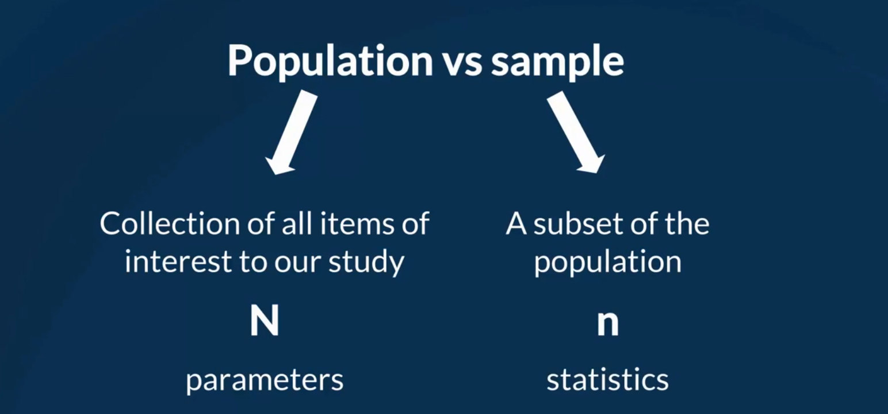
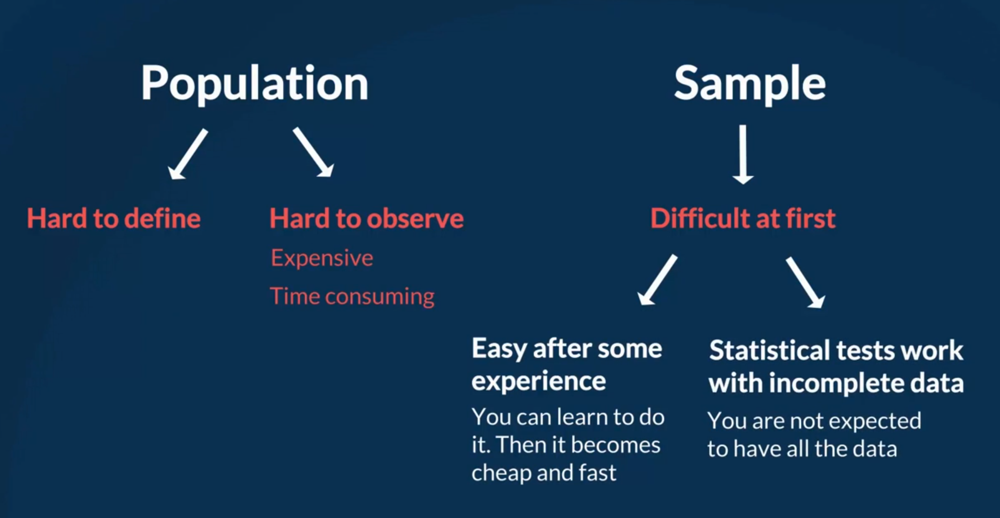

## Topic
Before crunching any numbers and making decision, we should introduce some key definitions.

The first step of very statistical analysis you will perform is to determine whether the data you are dealing with is `population`, or `sample`
## Keywords and Notes
### Population vs Sample

`Population` is the collection of all items of interest to our study and is usually denotes with an uppercase `N`. The numbers we've obtained when using a population are called `parameters`.

`A sample` is a subset of the population and is denoted with a lowercase `n`, and the numbers we've obtained when working with a sample are called `statistics`

Let's say we want to make a survey of the job prospects of the students studying in the New York University. 

`What is the population?`

You can simply walk into NYU and find every student, right? Well probably, that would not be the population of NYU students. 

The population of interest includes not only the students on campus, but also the ones at hone, on exchange, abroad, distance eduction students, part time students, even the ones who are enrolled but are still at high school. Though exhaustive, even the list misses someone.

Point taken, populations are hard to define and hard to observe in real-life.

`A sample`, however, is much easier to contact. It is less time consuming and less costly. Time and resources are the main reasons we prefer drawing samples compared to analyzing an entire population.

`So, lets draw a sample then`. As we first wanted to do, we can just go to the NYU campus. Next let's enter the canteen because we know it will be full of people. We can then interview 50 of them, cool, this is a sample.

But what are the chances of these `50` people provide us answers that are a true representation of the whole University? The chance is pretty slim. 

The sample is neither random, nor representative. A `random sample` is collected when each member of the sample is chosen from the population strictly by chance. We must ensure each member is equally likely to be chosen.

Let go back to our example. We walked into the University Canteen and violated both condition. People were not chosen by chance, they were group of NYU students who were there for lunch. Most members did not even get the chances to be chosen as they were not on campus.

Thus we conclude the sample was not random.

`What about the representativeness of the sample?`

`A representative sample` is a subset of the population that accurately reflects the members of the entire population

`Our sample is not random` but was it `representative`?

Well, it represented a group of people but definitely not all students in the university. To be exact it represented the people who have lunch at the University canteen.

Had our survey been about job prospects of NYU students who eat in the University canteen we would have done well.

`How to draw a sample that is both random and representative`. Well, the safest way would be to get access to the student database and contact individual in a random manner. However, such surveys are almost impossible to conduct without assistance from the University.

We said population are hard to define and observe.

Then we saw that sampling is difficult. But samples have two big advantages. 
* First, after you have experience, it is not hard to recognize, if a sample is representative.
* Second statistical tests are designed to work with incomplete data. Thus, making a small mistake while sampling is not always a problem.

> Note
After completing this course samples and populations will be a piece of cake for you.
