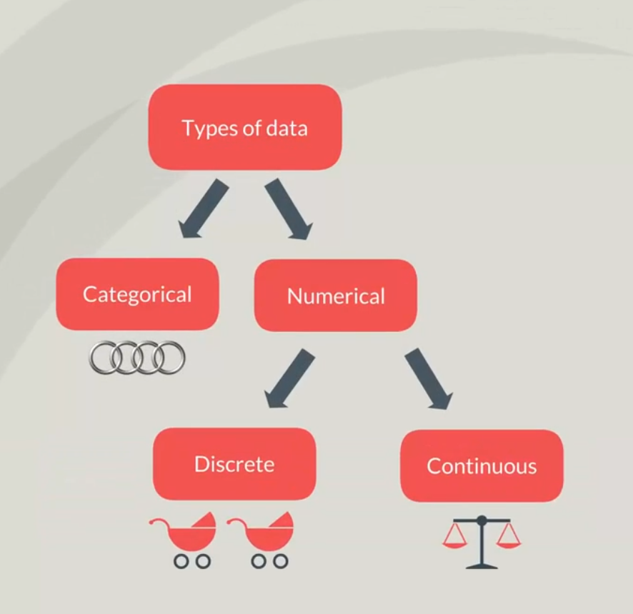
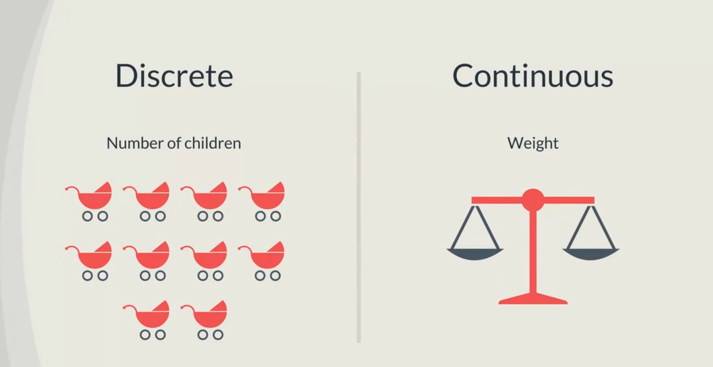

## Topic
You were probably watching this course because you want to learn the appropriate statistics to perform different tests. However before we can start testing we have to get acquainted with the types of variable usually encounter, different type of variables required different type of statistical tests as such it is key to be able to classify the data you are working with we can classify data in two main ways based on its `type` and `on its measurement level`. 

## Keywords and Notes
### Types of Data
There is `categorical` and `numerical data`. 

`Categorical data` describes categories or groups. One example is `car brands` like Mercedes, BMW and Audi, they show different categories. Another instance is answers to `yes and no` questions. If I ask question like `Are you currently enrolled in a university or do you own a car`, yes and no, would be the two groups of answers that can be obtained. This is categorical data.

`Numerical data` on the other hand as its name suggests represents `numbers`. It is further divided into two subsets `discrete` and `continuous`. `Discrete` data can usually be counted in a finite matter. A good example would be `the number of children that you would want to have`. Even if you don't know exactly, how many, you were absolutely sure that the values will be an integer such as `0, 1, 2, or even 10`. Another instance is `grade on the SAT exam`. You many get `1000, 1560, 1570, or 2400`. What is important for a variable to be defined as `discrete` is that you can imagine each member of the dataset knowing that SH scores range from `600` to `2400` and 10 points separate all possible scores that can be obtained is key.

It's easier to understand `discrete data` by saying it's the opposite of `continuous data`. `Continuous data` is infinite and `impossible` to count. For instance your weight can take on every values in some range. You get on the scale and the screen shows `150 pounds` or `60.389 kg`. But this is just a approximation, if you gain `0.01 pound` the figure on the scale is unlikely to change. Put your new weight will be `150.01 pounds`. Now think about sweating every drop of sweat reduces your weight by the weight of that drop. But a scale is unlike to capture the change. Your exactly weight is `continuous variable`. It can take an `infinite` amount of values no matter how many digits there are after the dot.

To sum it up your weight can vary by incomprehensibly small amounts and is `continuous` while the number of childdren you want to have is directly understandable and is `discrete`.

