## Topic
You were probably watching this course because you want to learn the appropriate statistics to perform different tests. However before we can start testing we have to get acquainted with the types of variable usually encounter, different type of variables required different type of statistical tests as such it is key to be able to classify the data you are working with we can classify data in two main ways based on its `type` and `on its measurement level`. 

## Keywords and Notes
## The fundamental of descriptive Statistics
### Types of Data
There is `categorical` and `numerical data`. 


`Categorical data` describes categories or groups. One example is `car brands` like Mercedes, BMW and Audi, they show different categories. Another instance is answers to `yes and no` questions. If I ask question like `Are you currently enrolled in a university or do you own a car`, yes and no, would be the two groups of answers that can be obtained. This is categorical data.

`Numerical data` on the other hand as its name suggests represents `numbers`. It is further divided into two subsets `discrete` and `continuous`. `Discrete` data can usually be counted in a finite matter. A good example would be `the number of children that you would want to have`. Even if you don't know exactly, how many, you were absolutely sure that the values will be an integer such as `0, 1, 2, or even 10`. Another instance is `grade on the SAT exam`. You many get `1000, 1560, 1570, or 2400`. What is important for a variable to be defined as `discrete` is that you can imagine each member of the dataset knowing that SH scores range from `600` to `2400` and 10 points separate all possible scores that can be obtained is key.

It's easier to understand `discrete data` by saying it's the opposite of `continuous data`. `Continuous data` is infinite and `impossible` to count. For instance your weight can take on every values in some range. You get on the scale and the screen shows `150 pounds` or `60.389 kg`. But this is just a approximation, if you gain `0.01 pound` the figure on the scale is unlikely to change. Put your new weight will be `150.01 pounds`. Now think about sweating every drop of sweat reduces your weight by the weight of that drop. But a scale is unlike to capture the change. Your exactly weight is `continuous variable`. It can take an `infinite` amount of values no matter how many digits there are after the dot.

To sum it up your weight can vary by incomprehensibly small amounts and is `continuous` while the number of childdren you want to have is directly understandable and is `discrete`.


### Levels of Measurements
In the previous section we distinguish between `categorical` and `numerical` data. Furthermore we saw that numerical data can be `discrete` and `continuous`.

It's time to move on to the other classification `levels of measurements`. These can be split into two groups `qualitative` and `quantitative data`. They are very intuitive.
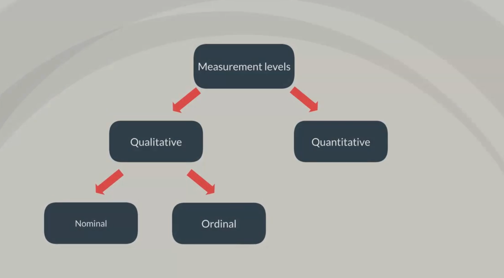

`Qualitative data` can be `nominal` or `ordinal`. 

`Nominal values` or like categories we talked about just now `Mercedes, BMW or Audi` or like the four seasons `winter, spring, summer, and autumn` they are not numbers and cannot be put in any order.


`Ordinal data` on the other hand consists of `groups` and `categories` but follows a strict order. Imagine you have been asked to rate your lunch and the options are `disgusting, unappetizing, neutral, tasty and delicious` although we have words and not numbers. It is obvious that these preferences are ordered from negative to positive. Thus the data is `qualitative ordinal`.


So what about `Quantitative variable`. Well as you may have guessed by now they are split into two groups `interval` and `ratio`. Interval and ratios are both represented by numbers but have one major difference, `ratios` have a `true zero` and `intervals don't`.

For example `length` is a ratio variable. You all know that `0 inches` or `0 feet` means no length, with `temperature`, however we have a different story. It is usually an `interval variable`. Usually it is expressed in `Celsius` or `Fahrenheit` They are both `interval variables`, `zero degrees Celsius` or `zero degrees Fahrenheit` don't mean anything, as the absolute zero temperature is actually negative `273.50 degree celsius` or `negative 459.67 fahrenheit`
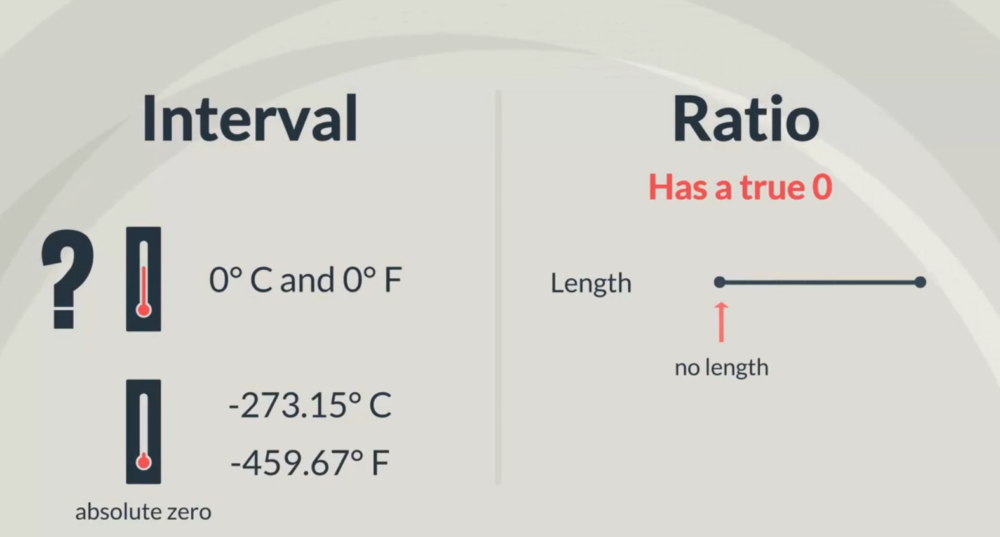

In the case of `interval variables` the difference is meaningful but the `zero` is not. Continuing this temperature example, there is another scale `kelvins`. According to it the absolute minimum temperature is `zero degree kelvin`. Therefore if the degree are stated in Kelvin the variable will be a `ratio`.
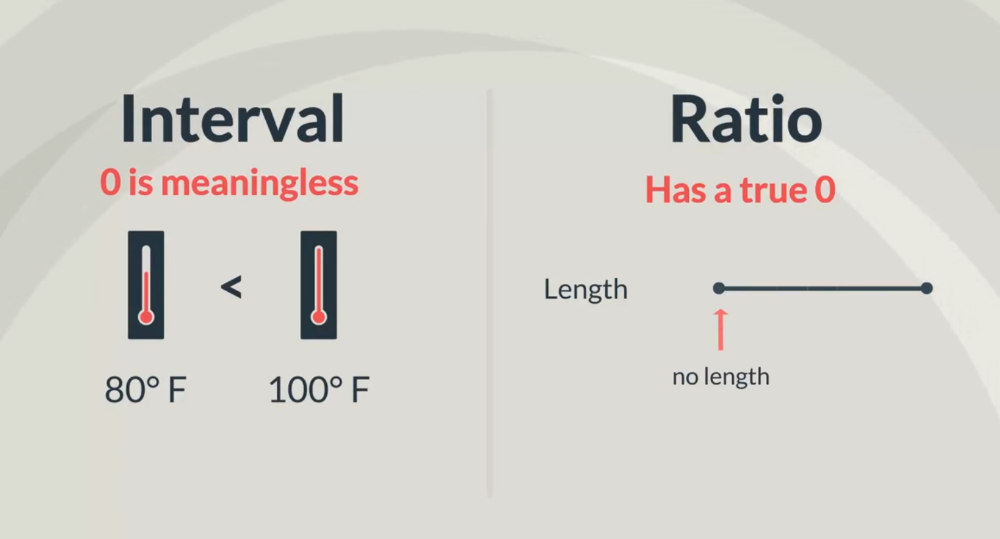

So numbers like `2, 3, 10, 10.5, pie, etc` can be both an `interval` or `ratio` measurement. But you have to be careful with the context you are using them in.

All right we've quickly gone through the types of data and the measurement levels.
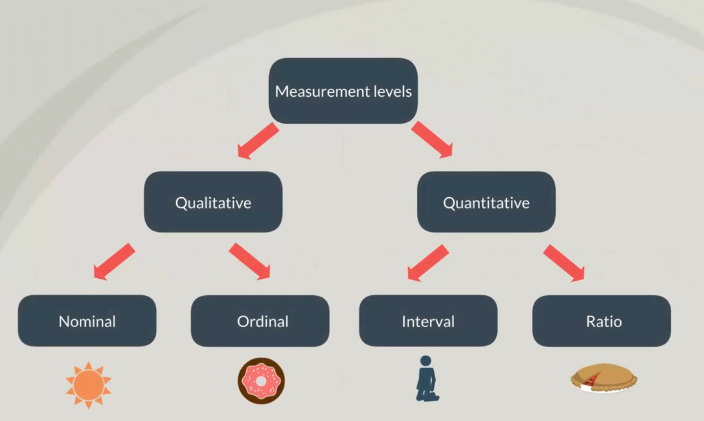

 Stick around to see the types of graphs that are used on a daily basis when  performing statistical analysis.

### Categorical variable | Visualization techniques of categorical variable

Now that we've seen the different types of data and levels of measurment we can have, we are ready to explore different graphs and tables which will alow us to `visually present the data we are working with`.

Visualizing data is the most intuitive way to interpret it.So it will be great if we learn how to do that.


As you may recall there are two types of variables `categorical` and `numerical`.

In this section we will focus on `categorical variables`. The most common way to visualize them are `frequency distribution tables`, `bar chars`, `pie charts`, and Pareto diagrams.

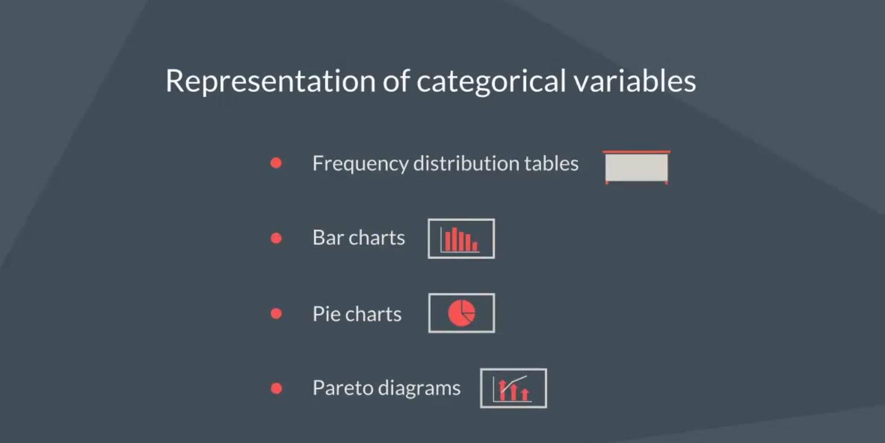

First let's see what the `frequency distribution table` look like. It has `two columns`, the `category itself` and the `the corresponding frequency`

Imagine you own a car shop and you sell only German cars. The table below shows the categories of cars. `Audi, BMW, and Mercedes` and their `frequency` or in plain English `the number of units sold`.

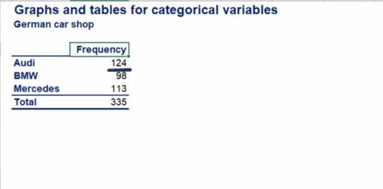

By organizing your data in this way you can compared the different brands and see that `Audi has been sold the most`.

 No preference is on my side, however tables aren't much fun, using the same table, we can construct a `bar chart`.

 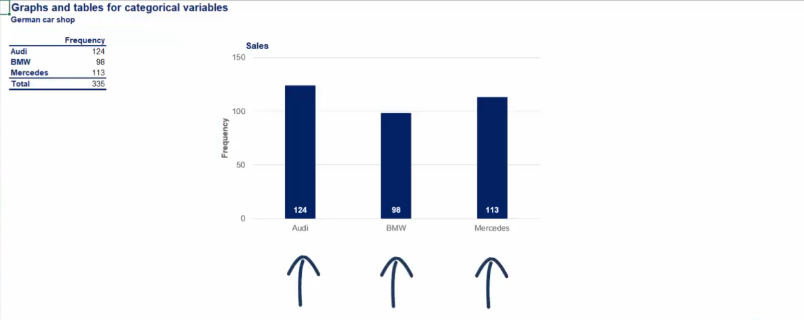

 The `vertical axis` shows the number of units sold while each bar represents a `different category` indicated on the `horizontal axis`. In this way it is much clear that `AUDI` is the best selling brand.

 Ok let's represent the same data with a `pie charts`, in order to build one, we need to calculate the percentage of the total of each brand in statistics, this is known as `relative frequency`. 

 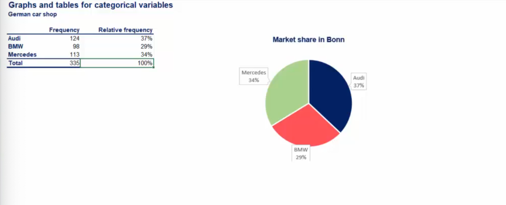

 `Relative frequency` is the percentage of the total frequency of each category. Naturally all relative frequencies add up to 100 percent. Pie charts are especially useful when we not only want to compare items among each other but also to see their share of the total.

 This example could be easily transformed into a business example of market share. Market share is so predominantly represented by pie chares that if you `search` for market share in google images you would get only pie charts.

Imagine that the data in our table is representing the sales of Audi, BMW and Mercedes in a single German city, St. ban. The chart will show us the market share that each of these brands has.

Lastly, we have `Pareto diagram`. In fact `Pareto diagram` is nothing more than a special type of bar `chart` where categories are shown in descending orders of frequency.

By `Frequency`, Statisticians mean the `number of occurrences of each item`. As we said earlier in our example that's exactly the number of units sold. 

Let's go back to our frequency distribution table and ordered the brands by frequency. Now we can create the bar charts based on our `reorder table` and we almost have a `Pareto diagram`

Theres is one last touch to make it one, a curve on the same graph showing the `cumulative frequency`. 

`Cumulative frequency` is the sum of relative frequencies. It stars as the frequency of the first brand, then we aadd the second, the third and so on until it finishes at 100 percent.

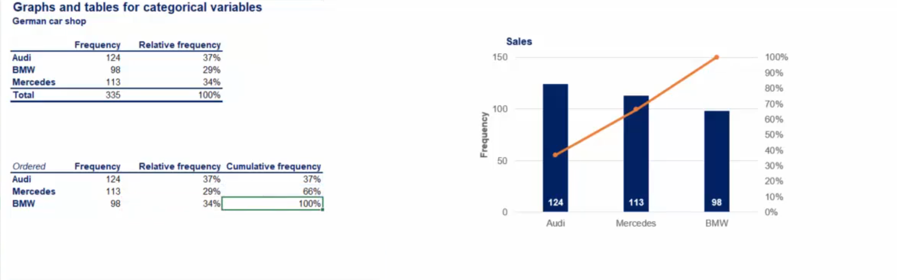


The `polygon line` is measured by a different vertical axes on the right of the graph. At the end of its vertices it shows the sum total of the catagories to its left.

See how the `Pareto diagrams` combines the strong sides of the `bar and the pie chart`. It isi easy to compare the data both between categories and as a part of the total. 

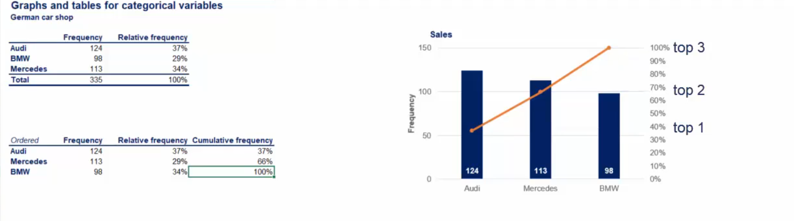
Furthermore if this was a market share graph you could easily see the market share of the top two or top five companies.

These are the main ways in which we visually represent `categorical data.

### Challenge  | Categorical variables. Visualization techniques
#### Challenge 1 | Frequency Distribution table
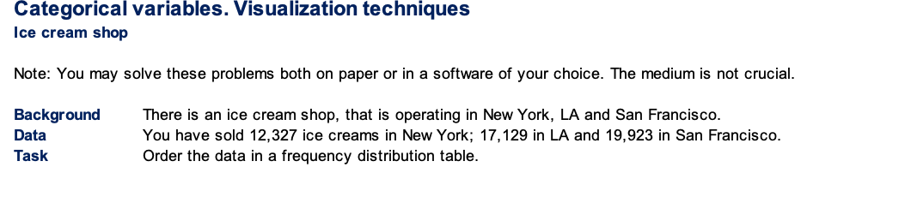

> Solution to the Challenge

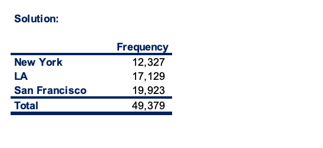

#### Challenge 2 | Bar Graph


> Solution to the Challenge

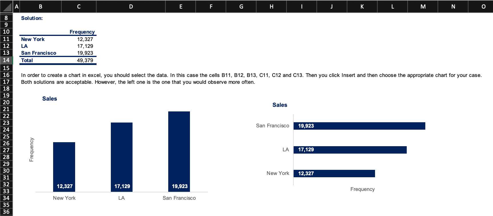

#### Challenge 3 | Pie Chart
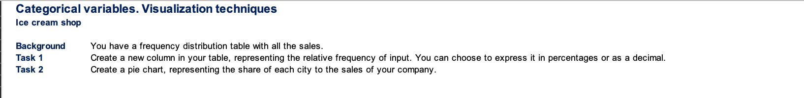

> Solution to the Challenge
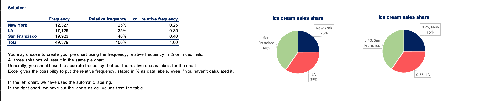

### Challenge 4 | Pareto Diagram
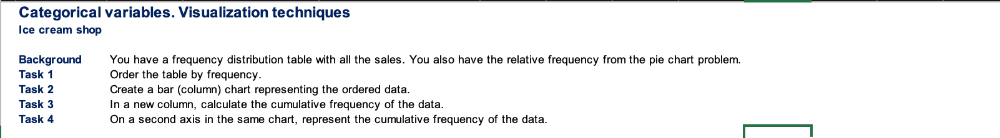

> Solution to the challenge
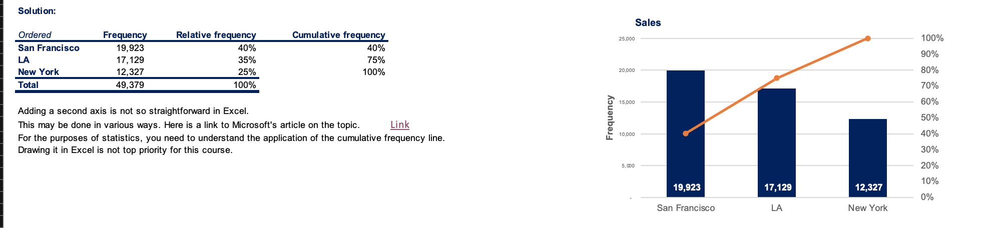

[Here is a link to Microsoft's article on the topic](https://support.office.com/en-us/article/Add-or-remove-a-secondary-axis-in-a-chart-91da1e2f-5db1-41e9-8908-e1a2e14dd5a9)

### Numerical Variables | Using Frequency Distribution Table

We already know how to create graphs and tables for categorical variables in this lesson. We're going to do the same for `numerical variables`, and given that `numerical data` is the main focus of this course. We will spend a couple of lesson on this topic.

Now whenever we want to plot data, it is best to first order it in a table. So as we did with `categorical variables`, let's start by creating a `frequency distribution table`.

Here is the list of `20 different numbers`.
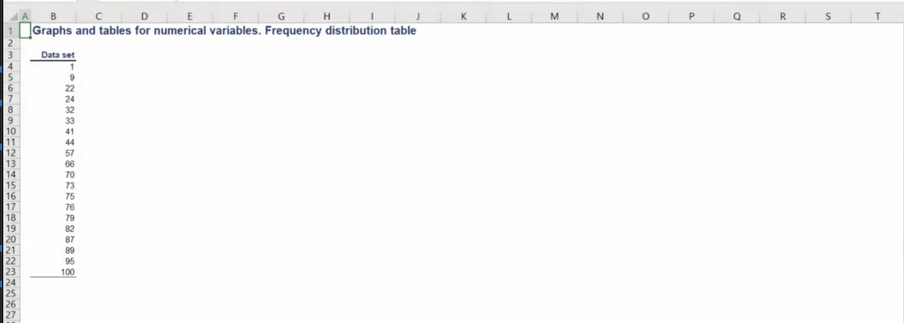

If we arrange them in a frequency table like the one we use for categorical variables we would obtain a table with `20 rows` each of them representing one number of a corresponding frequency of one, as each number occurs exactly one time. 
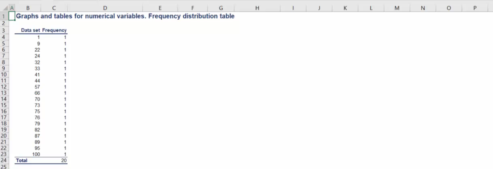

This table would be `impractical` for any analysis right? Well when we deal with numerical variables it makes much more sense to group the data into `intervals`, and then find the corresponding `frequencies`

In this way we make a summary of our data that allows for a `meaningful visual representation`.

`How do we choose these intervals`, Generally statisticians prefer working with the groups of data that contain `5 to 20 intervals` but it depends....

This way the summary can be useful. However this varies from case to case and the correct choice of intervals largely depends on the amount of data we are working with, in our example, we will divide the data into `five intervals` of equal length.
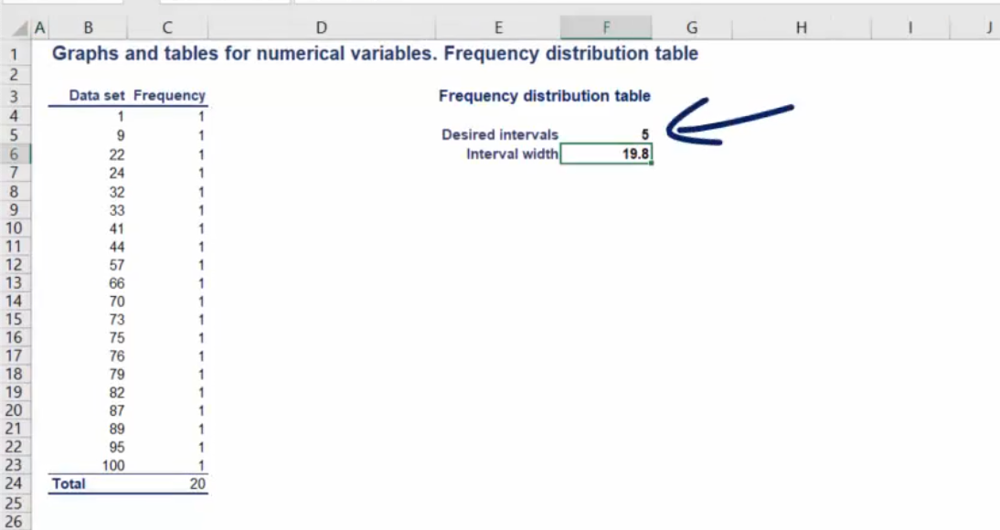

The simple formula that we use is as follows
`The interval width is equal to the largest number minus the smallest number divided by the number of desired intervals`. In our case the length of the interval should be `100 minus 1 divided by 5`, the result is `19.8`, now we want to round this number up in order to reach a neater representation, which will be 20.
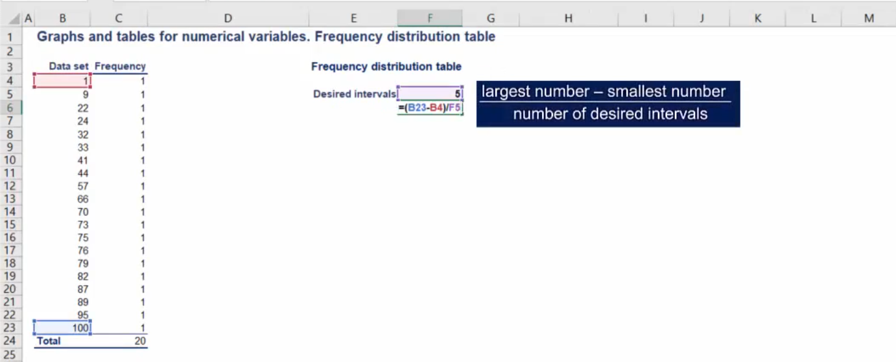

Therefore our intervals will be as follows `1-21`, `21-41`,`41-61`,`61-81`, and `81-101`. Each Interval has a with of `20`.
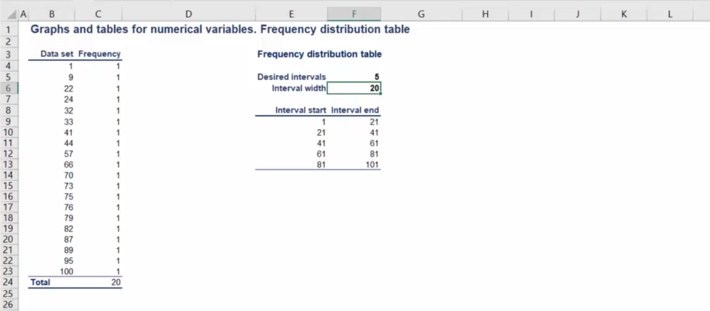

> Let's try to construct the frequency distribution table

We will have to work with two components, `intervals` and `frequncy`, as we can see from the table below.
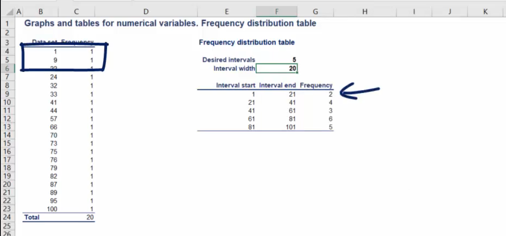

For many analysis it is useful to `calculate the relative frequncy` of the data points. As we said in a previous section the `relative frequncy is the frequncy of given interval as a part of the total`.

Let's add another column to our table and name it `relative frequency`.
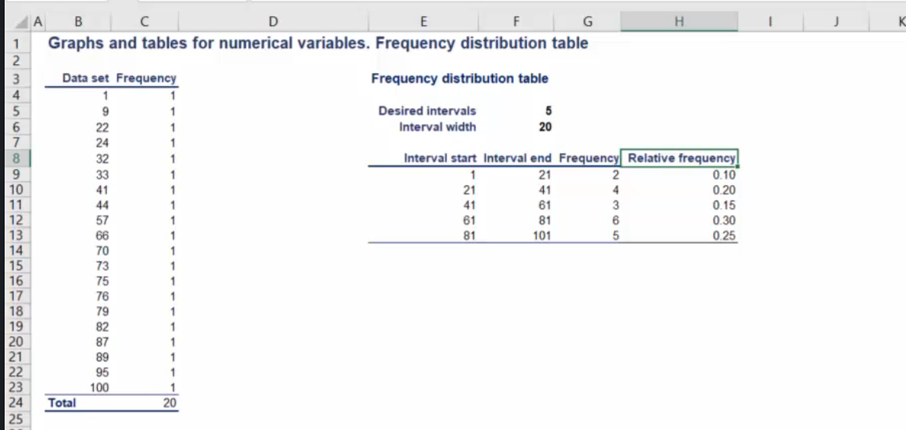

So the interval from `1-20` has an `absolute frequency of 2` but a `relative frequency of 2 divided by the total 20 numbers` which gives us `10 percent` and so on as we fill the table. 

All right this is how we calculate relative frequencies.Now that we have summarized the `raw data` we can start plotting it.

#### Challenge | Numerical variables. Frequency distribution table
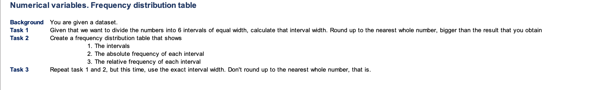

> Solution to the challenge
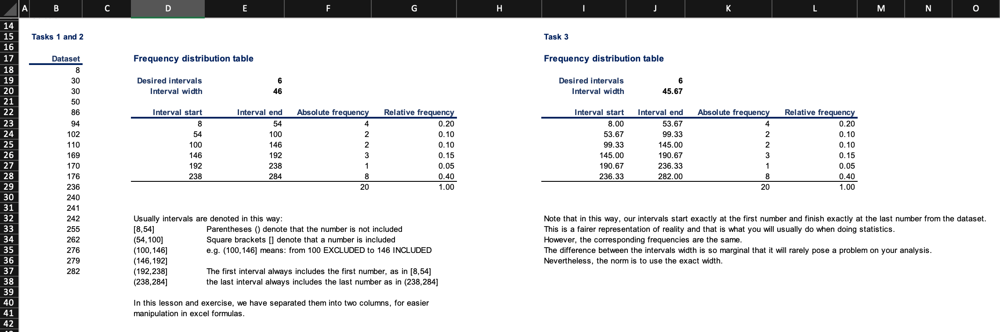

```
//Count based on interval excel
=COUNTIF($B$18:$B$37,">="&D23)-COUNTIF($B$18:$B$37,">"&E23)
```


