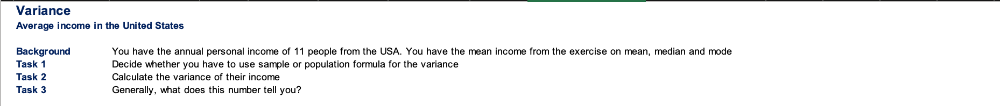

## Topic

It is time for us to dive into the heart of `descriptive statistics`, `measurements of central tendency` and `variability`.

## Keywords & notes

### Measures of Central tendency

This lesson we'll introduce you to the three measures of central tendency. Don't be scared by the terminology we are talking about `mean`, `median` and `mode` event if you are familiar with these terms.


The first measure we will study is the `mean`, also known as `simple average`. It is dentoted by the Greek latter `mue` for population and `x bar` for a sample.


These notion will come in handy in the next section.

We can find the mean of dataset by adding up all of it components and then diving them by the number of components contained in the data set.


The mean is the most common measure of `central tendency` but it has a huge downside. `It is easily affected by outliers`.

Let's compare these two data sets.


These are the price of pizza at 11 different locations in New York City and 10 different locations in LA. Let's calculate the means of the two data sets using the formula.


For the mean in NYC, we get `$11` whereas for LA just `$5.5` on average pizza.

> On average, pizza in MY can't be twice as expensive as in LA, right? Correct

The problem is that in our sample we have included one posh place in New York where they charge `$66` for pizza, and this doubled the mean, what we should take away from this example is that `the mean is not enough to make definite conclusions!`

So how can we protect ourselves from this issue. You guessed it, we can calculate the second measure, `the median`, the median is basically the `middle number` in an `ordered dataset`.

Let's see how it works in our example

In order to calculate the median we have to order our dataset in ascending order, `the median of the dataset is the number at position n plus 1, divide by two in the ordered list whee n is the number of observations`


Therefor the median for NYC is at the 6 position or `6` much closer to the observed price than the mean of `$11`.

What about LA, we have just 10 observation in LA. According to our formula the mean is at position `5.5`. In case like this the mean is simple average of the numbers, at position 5 and 6. Therefore the median of LA prices is `5.5` dollars.


We have seen that the median is not affected by `extreme prices which is good` when we have posh New York restaurants in a street pizza sample, but we still don't get the full picture of the majority of restaurants, low cost or average


We must introduce another measure `the mode`.The `mode` is the value that occurs most often`. It can be used for numerical and categorical data but we will stick to our numerical example.

After counting the frequencies of each value we find that the mode of `New York Pizza` prices is `$3`, now that's interesting. The most common price of pizza in NYC is just `$3` but the mean and median lead us to believe it was much more expensive.

Let's do the same fnd find the mode of LA pizza prices, from `each price appears only once`. How do we define the mode then. Well, we say that `there is no mode`, but can I say that there are 10 modes you may ask?.

Sure you can but it will be meaningless with 10 observation and an experienced statistician would never do that.

In general you often have multiple modes usually two or three modes are tolerable. But more than that would defeat the purpose of finding a mode.

> There is one last question that we haven't answered which measure is best?

The NYC and LA, example shows us that measures of central tendency should be used together rather than independently. `There is not best... but using only one is definitely the worst`

Now you know about the mean, median and mode, in our next video we will use that knowledge to talk about `skewness`

#### Mean, Median and Mode | Challenge


> Solution to the challenge
> 

```
Execel formulas
MEAN - =AVERAGE(B11:B21)
MEDIAN - =MEDIAN(B11:B21)
MODE - =MODE.SNGL(B11:B21)
```

### Measuring Skewness

After exploring the measures of `central tendency`, let's move on to the measure of `asymmetry`. The most commonly used tool to measure asymmetry is `skewness`.


This is the formula to calculate it, almost always you will use `software that performs the calculations` for you.

So in this lesson we will not get into the computation but rather the meaning of `skewness`.


So `skewness` indicates whether the observations in a dataset are concentrated on one side, `skewness` can be confusing at the beginning.

So an example is in place. Remember frequency distribution tables from previous lectures. Here we have three datasets and their respective frequency distributions. We have also calculates the means, medians and modes.

> Positive Skew / Right skew


The first dataset has a mean of `2.79` and median of `2.00`, hence the `mean > median`. We say that this is a positive or `right skew`. From the graph, you can clearly see that the data points are concentrated on the left side. Note the direction of the skew is counter-intuitive.

It does not depend on which side the line is leading to but rather to which side it's `tail` is leading. So `right skewness` means that the outliers are to the right.

It is interesting to see the measures of central tendency incorporated in the graph when we have `right skewness the mean is bigger than the median` and the `mode is the value with the highest visual representation`


> Zero or no skew
> 

In the second graph, we have plotted a data set that `has an equal mean, median and mode`, the frequency of occurrence is completely symmetrical and we call this a `zero or no skew`.

Most often you'll hear people say that the `distribution is symmetrical`

> Negative skew


For the third dataset, we have a mean of `4.9` a median of `5` and a mode of `6`, as the `means is lower than the median`, we say that there is a `negative or left skew`. Once again the highest point is defined `by the mode`.

Why is it called a `left skew` again? Because the `outliers` are to the `left`

So why is skewness important. Skewness tells us a lot about where the data is situated. As we mentioned in our previous lesson, the mean, median and mode should be used together to get a good understanding of the dataset, `measure of asymmetry` are the link between the `central tendency` measures and `probability theory` which ultimately allows us to get a more complete understanding of the data we are working with.

#### Skewness | Challenge


> Solution to the challenge
> 

### Measure of Variability

There are many ways to quantify variability. However we will focus on the most common ones, `variance`, `standard deviation` and `coefficient of variation`.

In the field of statistics we will typically use different formulas when working out the population data and sample data.

When you have the whole `population` each data point is known, so you are 100% sure of the measure you are calculating, when you take a `sample of this population`, and you compute a `sample statistic, it is interpreted as an approximation of the population parameter`.

Moreover if you extract 10 different samples from the same population you will get 10 different measures. Statisticians have solved the problem by adjusting the algebraic formulas for many statistics to reflect. Therefore we will explore both population and sample formulas as they are both used.

You must be asking yourself why there are unique formulas for the mean, median and mode.


`Mean`, well actually the sample mean is the average of the sample data points. While the population mean is the average of the population data points. Technically there are two different formulas but they are compute in the same way.

Ok now after this short clarification it's time to get on a `variance` measure of the `dispersion`

### VARIANCE

`Variance` measure the dispersion of a set of data points around their mean value.


`Population variance` denoted by Sigma squared is equal to the sum of square difference between the observed values and the population mean divided by the total number of observations.


`Sample variance` is denoted by `s squared` and is equal to the sum of squared differences between observed sample values and the sample mean divided by the number of sample observation minus one.


All right when you are getting acquainted with statistics it is hard to grasp everything right away.

Therefore let's stop for a second to examine the formula for the population and try to clarify it's meaning


The main part of the formula is its numerator. So that's what we want to comprehend. The sum of the differences between the observation and the mean squared.


So the closer the number of the mean the lower the result we will obtain. And the further away from the mean it lies the larger the difference.

Easy, but why do we elevate the second degree. Squaring the differences has two main purpose. First by squaring the numbers we always get non-negative computations. Without going deep into the mathematics of it is intuitive that dispersion cannot be negative.

`Dispersion` is about distance and distance cannot be `negative`. If on the other hand we calculate the difference and do not elevate to the second degree we would obtain both positive and negative values, that when summed would cancel out leaving us with no information about the dispersion.

Second `squaring amplifies the effect of large differences`, for example if the mean is 0 and you have an observation of 100 the squared spread is 10000


> Example
> We have a population of 5 observations, `1,2,3,4,5`, Let's find it's variants. We start by calculating the means.


Then we just apply the formula of findin the variance of a population.


So the population variance of the data set is `2` but what about `sample variance`. This would only be suitable if we were told that these five observation were a sample drawn from a population, so let image that is the case.


Denominator is going to be 4 instead of 5, giving us a sample variance of `2.5` to conclude the variance topic we should interpret the result.


`Why is sample variance bigger than the population variance` in the first case, we knew the population that is we had al the data and we calculated the variance, in the second case, we were told that `1,2,3,4,5` was a simple drawn form a bigger population,

#### Variance Challenge



#### Variance Solution


### Standard Deviation and Coefficient of Variation

While `Variance` is a common measure of data dispersion. In most cases the figure you will obtain is pretty large and to compare as the unit of measurement is squared.

The easy fix is to calculate its `square root` and obtain a static know as `standard deviation`. In most analysis you perform `standard deviation` will be much more meaningful than `variance`, as we saw previous lecture. There are diffrence measure for the `population` and `sample variance`. Consequently there is also `population` and `sample standard deviation`.


The other measure we still have to introduce is the `coefficient of variation`. It is equal to the `standard deviation` divided by the `mean`. Another name for the term is `relative standard deviation`. This is an easy way to remember its formula.


This is an easy way to remember its formula. It is simply the standard deviation relative to the mean as you probably guessed there is a `population and sample`. Once again so `standard deviation is the most common measure of variability for a single dataset.


Once again so `standard deviation` is the most common measure of variability for a single dataset. But why do we need yet another measure such as the coefficient of variation.

Well comparing the `standard deviation` for the `two different datasets` is `meaningless` but comparing coefficients of variation is not.


> Aristotle once said, tell me, I'll forget, show me, I'll remember, involve me, I'll understand.

> Example

Let take the prizes of pizza at 10 different places in New York. They range from `$1 to $11`. Now imagine that you only have Mexican pesos and to you the prices look more like `$18.81 - $206.91`

Given the exchange rate of `18.81 pesos for 1 dollar`. Let's combine our knowledge so far and find the standard deviation and coefficients of variation fo these two data sets.

`First` we have to see if this is a sample or a population. Are there only 11 restaurants in New York, of course not, this is obviously a sample drawn from all the restaurants in the city.

Then we have to use the formulas for the sample measure of variability.

`Second` we have to find the means, the means in dollars is equal to `5.5` and the mean in pesos is `103.46`

`Third` step of the process if finding the sample variance. Following the formula that we showed earlier we can obtain `10.72` dollars for pizzas and '3.793.69` dollars for pesos.


Let's make a couple of observations. First `variance` gives results in `squared unit` while `standard deviation` in original units.

This is the main reasons why professionals prefer to use `standard deviation` as the main measure of variability.

> Note: Standard deviation is the preferred measure of variability, as it is directly interpretable.

`Squared dollars` means nothing even in the field of statistics.

Second we got standard deviation of `3.27` and `61.59` for the pizza at the same eleven restaurants in New York City,seems wrong.

> Same pizza, same restaurants, but different standard deviations...

It is time to use our last tool, `The coefficient of variation`, dividing the standard deviations by the respective means we get the two `coefficients of variation`, the result is the same `0.60`.

Notice that is not dollars. Pesos dollars square or pesos squared. `It is just 0.60`.

`Advantage of using Coefficient of Variation`

> does not have a unit of measurement
> Universal across dataset
> Perfect for comparisons

This shows us the great advantage that the coefficient of variation gives us. Now we can confidently say that the two data sets have the same variability.

Which is what we expected beforehand.


> Recap
> There are three main measures of variability, `variance`, `standard deviation` and `coefficient of variation`.
> 

You should feel confident using all of them as we're getting closer to more complex statistical topics.

#### Standard deviation and Coefficient of variation Challenge


#### Standard deviation and Coefficient of variation Solution


### COVARIANCE
We're covered all univariate measures. 


Now it's time to see measures that are used when we work with more than one variable. In the next two lessons, we'll explore measures that can help us explore the relationship between variables.

Our focus will be on `covariance` and the `linear correlation coefficient`.


Let's zoom out a bit and think of an example that is very easy to understand and will help us grasp the nature of the relationship between two variables a bit better.

Think about real estate which is one of the main factors that determined `house prices`, their `size`. Typically larger houses are more expensive as people like having extra space.

The table that you can see here shows, data about several houses, on the left side, we can see the size of each house and on the right, we have the price at which it's been listed in a local newspaper.

We can present these data points in a `scatter plot` the `x axis` will show `House size` and the `y axis` will provide information about its `price`.

We can certainly notice a pattern, there is a clear relationship between these variables.


We say that two variables are correlated and the main statistic to measure this correlation is called `covariance` unlike variance, `covariance` may be positive equal to zero or negative. 

```
Covariance may be
> 0
= 0
< 0
```
To understand the concept better I would like to show you the formulas that allows us to calculate the covariance between two variables.

It's formulas with an S because once again there is a sample and population formula.


Since this is obviously sample data we should use the `sample covariance formula`. Let's apply it in practice for the example that we saw earlier, `x` will be the `house size` and `y` stands for `house prices`.

First we need to calculate the `mean size` and the `mean price`.

Now let's calculate the nominator of the `covariance` function starting with first house. We have to perform this calculation for al the houses that we have in the table and then sum the numbers we've obtained. The sample size is `five`.

Now we have to divide the sum above by the sample size minus one. 'The Result is the `covariance`.


It gives us a sense of direction in which the two variables are moving. 

```
Covariance gives a sense of direction

> 0, the two variables move together
< 0, the two variables move in opposite directions
= 0, the two variables are independent
```

There is just one tiny problem with `covariance` though it could be a number like `5` or `50` but it can also be something like `0.0023456` or even over `30 million`.

```
5
50
0.0023456
33,491,250
```

How could one interpret such numbers?. On the following section we will learn about `correlation coefficient`, which can help with this issue.


## Summary
