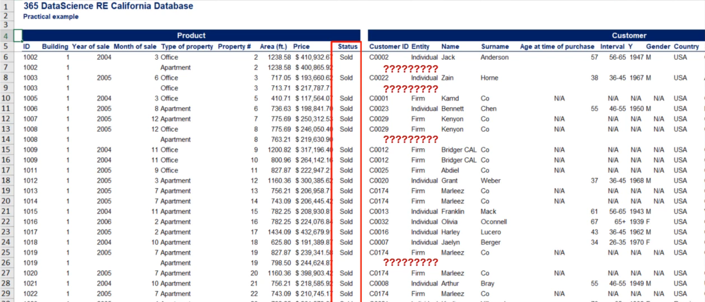

## Topics


Finally it's time for the practical example we've been talking about in this lesson, we will see an actual database of a real estate company operating in California.

We're interested in the statistical properties of the data. That is why we have reordered the database and cherry picked variables than imported DS in a spreadsheet.

The labels of the columns have been made friendly even for those of you who have no experience with real estate.

Finally we have altered the names of the customers for confidentiality reasons.

The company is launching a marketing campaign but it wants to target its audience properly.

The management suspects after some shore analysis marketing results can be improved without the need of investing additional resources.

We are the data analysis who are going to crunch some number and identify which groups of people are most likely to buy our product.

Once we have done so we will instruct the marketing team to focus its efforts on these groups.

`The first thing we have to do when we analyze data is get acquainted with the table.` It illustrates the skills of real estate property for a specific company. Let's call it 365 data sites real estate California. Hopefully no one else thought of that name.


Second the table has two parts the left and right, on the left hand side, we have the `product information`, on the right hand side, we have `customer information`.


You can easily sport all `products` are listed but customer information is only available for some `products`.


This is because we input information about a customer once the deal is done logically only `sold items` are associated with a buyer. This is because we input information about a customer once the deal is done, logically only `sold item` are associated with a buyer.


Let's see what a row looks like. This should clear up the logic of the table for your `Nora Lynch` with a customer id `C004` was 56 years old when she bought apartment 43 in building one, live there.

She paid `$377,313.56` for an area of `1160.36` square feet in June 2004, Nora is form California. Felt very satisfied with the deal and didn't get a mortgage for the purchase. She found out about our product through our website.

Now that's out of the way we need to dig deeper into these variables. We will identify types of data and levels of measurement for some of them. This is crucial steps as we cannot analyze the data, if we don't understand it's type.

Let's start from the first column ID. `ID` is a value we assign to each item that let's us differentiate between products. It may look `numerical` to you but it is `categorical` that's counter-intuitive the first time.

> ID may look numerical, but its categorical

So let's clarify it. What if we use the names like `John 1`, `John 2`, `John 3` and so on until John N. The meaning would not change `id` variable are like names we assign to different products. However it is much easier to use numbers as unlike names, we have an infinite number of numbers.

A simple way to check if a variable is numerical or categorical is to interpret its mean. The mean ID `Mean ID:2975` number shows nothing. Now oppose this to the mean price `Mean Price:$280,637`. The mean price is a valuable piece of information.

> Ok the bottom line is ID is a categorical variable.

`What about it's level of measurement?` Well it is qualitative `nominal`.

The next variable that we will explain is `Age`. Age is rather interesting. The level of measurement is `quantitative ratio` A rule used for verifying ratios is asking the question. Is there a true `zero point`.

Well for age when you are born you are exactly `zero years old`. That's the true zero point. So we are safe.

However once intriguing is whether age is discrete or continuous it may be both, in this case we can only see age as the whole number, therefore it is `discrete`. However similar to weight of variable we discussed earlier in this course. `Age` is a continuous variable.

When I am recording this the Statue of Liberty is 131 years old but I may get more specific by saying, it is 131 years and 11 months old or it age is 131 92. If I had days minutes and seconds I'll get 131 nine thousand four hundred twelve, you get the point when dealing with age, you decide it's time depending on your work at hand. This is yet another way to represent age.

The next variable we have is age interval. This is yet another way to represent age. Once again it is continuous or discrete as we are talking about the same variable. This time through the level of measurement is ordinal instead of a ratio, the age groups represent different categories ordered but are not numerical.

This shows that the same variable can have different levels of measurement within the same database.

In most corporate analysis `price` is Central no matter the data set, it is always a numerical variable, that like age may be discrete or continuous depending on your needs.

If you are interested banks and corporations treat it as continuous and so will we. The level of measurement here is ratio.

The next variable we want to look to is `gender`. It is categorical type and its level of measurement if `nominal`.

```
Gender
Type of data: categorical -> Male or Female
Level of measurement: nominal
```

It is similar to `yes` `no` questions discussed in a previous lesson. Such variables are called binary as there are only two possibilities.

```
Variables that can only take two possible values are called binary:
Male, female;
Yes, no
```

Finally let's check out the `location`. We will discuss state in more detail and leave country for homework.

The `state variable` refers to sales in the USA only. Note that only if the country input is USA, would we have a value for state. State is a categorical variable like ID, we talked about earlier.

```
State is a categorical variable like ID
```

You can label the US states from 1 to 50 and use numbers instead.


Either way the variable is `categorical` and it's level of measurement is `nominal`.

We've categorized the variables we will use in this section.

> Note 
This spreadsheet is available for you in the resources section with the exercises we've prepared on this database, you can practice the entire section about descriptive statistics.

Back to our problem at hand we must identify the groups of people who buy the most of our product. Let's start with `gender` 

Before we can plot the data, we must create the `frequency distribution table`. In the course notes, you can see how that's done in Excel. However in this section I'll skip this step and get to the `Frequency distribution table`.

Now we have three possibilities for `gender male and female` or a cell where gender is not available `NA`, since some properties were purchased by companies they have no gender. We have to include them in the analysis or explain why we omitted in the report.

`Gender is categorical`, we said that a good way to represent it in practice is with a `pie chart`.


Ok we can clearly see most clients are male. However this information is biased as the customers in this database are the people who signed the contract. It is likely a family bought the apartment but our data shows us only the person who signed the contact.

Such variables are interesting to see but it is not a good idea to include them in the data driven decisions we make.

Ok let continue with the `location`. What chart would be useful to show this? State is a `categorical variable`. We may use a `bar chart` or `pie chart`. However I prefer the `Pareto diagram` as it gives additional information.


From the graph, you can immediately see, most clients are from California. A possible scenario is to invest in marketing for the top 75% of the locations. This will mean we can focus on `California` and `Nevada alone`.

Next we want to see `age`. First we have to note that age represent the age of the buyer when the deal was sealed. The formula used is the year of the deal minus the year of the birth of the buyer.

We are doing this because we want to see the age at which customers buy our products. Their current age is irrelevant. Real estate is something people rarely buy more than once in their life. So age will probably be a central variable in our analysis.

Let's first plot the frequency distribution of age, this is done by creating a histogram with an interval length of one.


Now we can move on to the age interval representation. The option are `18 to 25`, `26 to 35`, `36 to 45`, `56 to 65` and `65+`, most of the data falls between `25 to 60` which is evident from the frequency distribution graph.


Therefore our intervals are a good fit of the data. Let's build a new histogram based on them. This presentation is much neater isn't it?


We can clearly see `36 to 45` is the age at which most people purchase a real estate property. It is evident that customers from `26 to 65` years old account for 71 percent of our observations.

But we are better than this, we can calculate more statistics to get an improved idea, can't we?. The mean and mode are the place where we usually start. The mean a 46.15, the median is 45.00, and mode is 48.00

The mean and median are close, so we have few outliers as you may recall. The mean is affected by them while the median is not when the mean is higher than the median we have positive skewness


Now is the time to remind yu that skewness shows too which side is the longer tail not where the data is concentrated.


Now for the mode we have 48 years you can see that from the `frequency distribution graph` but not from the histogram, the histogram bundles data together which is good when we want to see the main trend but some information like the mode is lost.

```
Some information may be lost when we bundle the data in histogram.
```

Finally we should inspect the variability of age before we can do so, we have to see if this is sample or population data.

The company data is the population of all people who are our customers. However our research aims to help the marketing department identify future customers. Therefore our dataset is a sample drawn from al the people who will eventually buy property from our company.

Henceforth we will use sample formulas. Let's compute both the `variance` and the `standard deviation`. The variance is measured in `squared years` while Standard deviation is measured in `years`.


So I suggest we stick with the standard deviation then shall we. The result is `St. dev. 12.84`. This shows us how dispersed the data is. What inferences can we make from this result.


Well that's the topic of the next section, so we all have to end here.

As you may have guessed our final stop is relationship between variables. Let's see if age determines how expensive an apartment that customer buy.

`May be younger people have less funds so they buy chepaer apartments`. We don't know the data will tell us first things first.

Let's plot the data both variables are numerical so we must use a `scatter plot`. Here it's


It is dispersed and there isn't an obvious trend. Let's confirm this observation by calculating the covariance of the two variables. We get this enormous value that doesn't tell us much. So it's suitable to standardize it by using the correlation coefficient. Teh value we get is `-0.17` much better.


This correlation is low. `A common practice is to disregards correlations that are below zero point`. So real estate expenditure is not related to get from a previous lesson, we know `price` and `size` are much more likely to be correlated.

What can we tell the marketing team after this short analysis. Well we got several insights.


First, males are more likely to sign contracts and are potentially a better audience for our ads. However we have no information about their martial status. This observation is unclear.


Second,`68%` of our sales come from California, with Nevada, Oregon, Arizona and Colorado forming 93% of the US customer case.


Third, 71% of the sales were made with customer aged between 26 and 55 years old, with a mean of 46 years and a standard deviation of 13 years.The distrubution is right skewed so we expect people to buy more property than older people. Younger people buy more property than older people


Finally There is no relationship between the age of a customer and the price they will pay.


