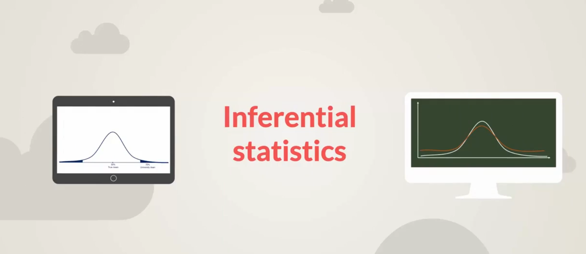
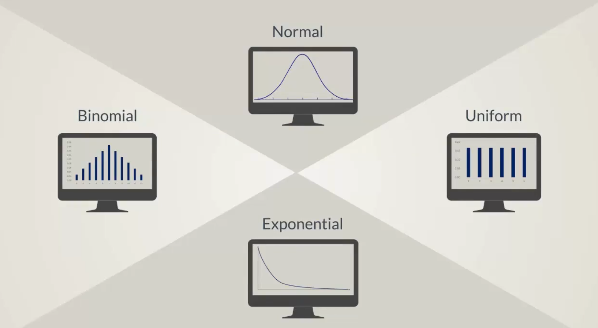

## Topics

## Introduction to Inferential Statistics


Now that we have covered the basics of `descriptive Statistics` it's time to move on to `inferential statistics`.


`Inferential Statistics` refers to methods that rely on `probability theory` and `distributions` to predict population values based on sample data.


While this definition may not clear just yet starting from the next lesson we will define what a distribution is and we'll go through a couple of distribution you will likely use a work.

This will naturally lead us to `point estimates` and we will conclude the section with `confidence intervals`.

We will not only present these topics but will also develop a deep understanding of the statistical processes.

This will help you a great deal if you get into data science.

These insights will likely be your gateway to the fundamentals of quantitative research and data driven decision making.

> Read More
> [Course Notes](./imgs/027%20Course-notes-inferential-statistics.pdf)

## Keywords & Notes

## What is a distribution?


Before we can talk about `testing` we have to learn what a distribution is, and in this lesson we'll do just that.

In statistics when we use the term distribution we usually mean a probability distribution. Good examples are `normal distribution`, `the binomial distribution` and the `uniform distribution`.


> Let start with the definition

`Def:` A distribution is a function that shows the possible values for a variable and how often they occur.


> Rolling a die
> Think about a die, it has 6 sides numbered from 1 to 6. We roll a die. What is the `probability of getting 1`? is `1/6`. What is the `probability of getting 2`? is `2/6`.

The same for the rest.


Now, what is the `probability of getting 7`?, it is impossible to get a `7` when rolling a die. Therefore the probability is `zero`.

The distribution of an event consist not only of the input values that can be observed but is made up of all the possible values. So the distribution of the event rolling a die will be given by the following table.


The probability of getting 1 is `0.17` the probability of getting `2` is `0.17` and so on. You are sure that you have exhausted all possible values when the `sum of the probabilities is equal to 100% for all other values`.

The probability of all other values is zero.

Each probability distribution is associated with a graph describing the like hood of occurrence of every event.

The below graph, this type of distribution is called `uniform distribution`.


It is crucial to understand that the distribution is defined by the underlying probabilities and not the graph. The graph is just a visual representation.

Now, think about rolling two dice. What are the possibilities, `(1,1),(2,1), (1,2)` and so on. Here's a table with all the possible combinations.


We are interested in the sum of two dice. So what's the probability of getting a sum of 1, the answer is `zero`, as this even is `impossible`.

`What is the probability of getting a sum of 2?`

There is only one combination that would give us the sum of two when both dice are equal to 1. So 1 out of 36 total outcomes or `0.03`.


Similarily the `probability of getting a sum of 3?` is given by the number of combinations that give a sum of three divided by `36`. Therefore `2/6` is `0.06`.


We continue this way until we have a full probability distribution.


Let's see the graph associated with it.
[Graph](./imgs/graph.png)

So looking at it we understand that when we roll two dice the probability of getting `7` is the highest. We can also compare difference outcomes such as the probability of getting a `10` and the probability of getting a `5`. It's evident that it's less likely that we'll get a 10.

The examples that we saw here were of discrete variables. Next we wil focus on `continuous distribution` as they are more common in inferences.

In the next few lessons we'll examine some of the main type of continuous distributions starting with a `normal distribution`.

> Course notes
> [Course notes](./imgs/028%20Course-notes-inferential-statistics.pdf)

## The Normal Distribution

So far we learned that the distribution of a data set shows us the frequency at which possible values occur within an interval.


We also said that there are dozens of distributions, experience statisticians can immediately distinguish a `binomial` from a `porcelain distribution` as well as a `uniform` from an `expoential` distribution in quick glimpse at a plot.



In this course though, we will rather focus on the `normal` and `student's T distributions` due to the following reasons.

1. They approximate a wide variety of random variables
2. Distribution of samples means with large sample size could be approximated to normal
3. All computable statistics are elegant
4. Decision based on normal distribution insights have a good track record.

Here is a visual representation of a `normal distribution`.


You have surely seen a normal distribution before as it is the most common one. The statistical term for it is `Gaussian distribution` but many people call it the `bell curve` as it is shaped like a bell.

It is `symmetrical` and its `mean, median and mode` are equal. If you remember the lesson about `skewness` you would recognize that it has no `skew`. It is perfectly centered around its mean. So it is denoted in this way.


```
N~(mean,variance) - N stands for normal. The `tilde` sign denotes it is  a distribution and in brackets we have the mean and the variance of the distribution.
```

You can notice that the highest point is located at the `mean` because it coincides with the `mode`. The spread of the graph is determined by the `standard deviation`.


Now let's try to understand the normal distribution a little bit better. Let's look at this approximately normal distribution histogram.


There is a concentration of the observations around the mean which makes sense as it is equal to the the mode.


Moreover it is symmetrical on both sides of the mean. We used 80 observations to create this histogram. It's mean is `743` and its standard deviation is 140.


> What if the mean is smaller or bigger?
> Let's zoom out a bit by adding the origin of the graph.
> 

> Controlling for the standard deviation

The origin is the zero point. Adding it to any graph gives perspective. Keeping the `standard deviation fixed or in statistical jargon` controlling for the standard deviation, `a lower mean would result in the same shape of the distribution`, but on the left side of the plane. In the same way a `bigger mean would move the graph to the right`.

In our example this resulted in two new distributions, one with the mean of `470` and a standard deviation of `140` and one with a mean of `960` and a standard deviation of `140`.


> Controlling for the mean
> We change the standard deviation and see what happens this time, the graph is not moving but is rather `reshaping` a lower standard deviation result in `lower dispersion`. So more data in the middle and thinner tails.
> 

On the other hand `higher standard deviation` will cause the graph to fly with less points in the middle and more to the end or in statistics jargon `fatter tails`


## The Standard Normal Distribution

The Standard normal distribution is a particular case of the normal distribution. We will use the letter `z` to denote it.

It has a mean of zero and a `standard deviation of one`, the standard normal distribution is easy to understand and has several important applications.

Every normal distribution can be `standardized`, standardization in this context is the process of turning a normal distributed variable to one with a standard normal distribution. 


A simple formula allows us to do that. The `standardized variable` the variable whose normal distribution are turning into a `standard normal` distribution is called a `z score`, it is equal to the original variable minus its mean divided by its standard deviation. 


Let's try to interpret it first, we have to look at the numerator, if you take a dataset, subtract its mean from eah data point and then calculate the mean once again, you will get 0.


The following example will help us prove that. Let's take an approximately normally distributed set of numbers 1,2,2,3,3,4,4 and 5.


Its `mean is 3` and its `standard deviation is 1.22`.

Now lets have subtracted the mean form all data points. We get a new dataset, then let' calculate its mean. It's mean is zero and its standard deviation is is `1.22`. 

So far we have a new distribution whish is still normal but with a mean of zero and standard deviation of 1.2 to the next step of standardization is to divide all data points by the standard deviation. This will drive the standard deviation of the new data set to 1.

Let's go back to our example. Both the orignal dataset and the one we obtained after subtracting the mean from each data point have a standard deviation of 1.22. Remember, adding and subtracting to all data points does not change the standard deviation. Now  let's divide each data point by 1.2, we get a new dataset, if we calculate the standard deviaito of this dataset we will get 1 and the mean is still zero.


This is how we can obtain a `standard normal distribution` from any `normally distributed dataset`. Using it makes predictions and inference much easier. And this will help us a great deal in what we will see next.

### Standard Normal Distribution Challenge


### Standard Normal Distribution Solution


## Summary
