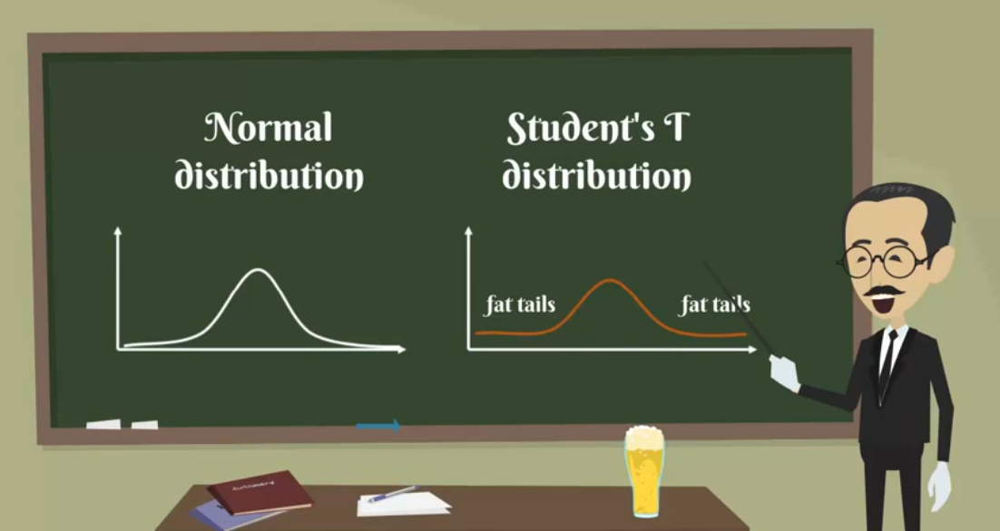

## Topics

## Keywords and Notes

## Estimators and estimates

Lets's continue by introducing the concept of an `estimator` of a population parameter, it is an approximation depending solely on sample information a specific value is called an `estimate`

There are two types of estimates, `point estimates` and `confidence interval estimates`.

`Point estimate` is a single number while `a confidence interval` naturally is an interval the two are closely related. In fact the `point estimate` is located exactly in the middle of the `confidence interval`. However `confidence intervals` provide much more information and are preferred when making inferences.

All right have we seen estimates so far? Sure we have, the `sample mean X bar` is a point estimates of the `population mean mue`. Moreover the `sample variance as squared` was an estimates of `population variance sigma squared`.

There may be many estimators for the same variable. However they all have two properties, `Bias and efficiency`, we will not prove them as the mathematics associated is out of the score of this course.

However you should have an idea about the concepts estimators are like judges.

We are always looking for the most efficient `unbiased estimator`, an unbiased estimator has an expected value equal to the population parameter.

Let's think of a biased estimator to explain that point. What if somebody told you that you will have to find the average height of Americans by taking a sample, finding its mean and then adding one foot to that result. So the formula is X bar plus 1 foot.

Well I hope you won't trust them. They gave you an estimator but a biased one. It makes much more sense that the average height of Americans is approximated just by the sample mean. We say that the bias of this estimator is `1 foot`.

Let's move on to efficiency. The most efficient estimators are the ones with the least variability of outcomes from the estimates we know so far we haven't seen estimators with problematic variants, so it is hard to exemplify.

It is enough to know that the most efficient means the `unbiased estimator with the smallest variance`

## Confidence Intervals

In previous lesson we learned about `point estimators`. But as you can guess they are not very reliable.

Imagine visiting 5 percent of the restaurants in London and saying that the average meal is worth 22.50 pounds. You many be close but chances are that the true values is it really 22.50 but somewhere around its much safer to say that the average meal in London is somewhere between 20 and 25 pounds.

In this way you have create a confidence interval around your point estimate of 22.50 pounds, Confidence Interval: [20pounds, 25pounds]

`Confidence Interval` is a much more accurate representation of reality. However there is still some uncertainty left which we measure in levels of confidence.

So getting back to our example you may say that you are `95% confident that the population parameters lies between 20 and 25 pounds.

Keep in mind that you can never be 100% confident unless you go through the entire population, and there is of course a 5% chance that the actual population parameter is outside of the 20 - 25 pounds range.
[5% chance](./imgs/not_sure.png)

We'll observer that if the sample we have considered deviate significantly from the entire population.

There is one more ingredient needed. The `level of confidence` it is denoted by `one minus alpha` and is called the confidence level of the interval.

Alpha is a value between `0 and 1`.

For example if we want to be 95 percent confident that the parameter is inside the interval Alpha is 5% If we want a higher confidence level say 99% Alpha will be 1%.

The formula for all confidence interval is from the point estimate minus the reliability factor times the standard error to the pont estimate plus reliability factor times standard error.

## Population Variance Known, Z-Score

A `confidence Interval` is the range within which you expect the population parameter to be and its estimation, is based on the data we have in our sample.

There are two main situations when we can calculate the confidence intervals for a population when `population variance known` and `population variance unknown`, depending on which situation we are in we would use different calculation method.

In this lesson we will explore the confidence intervals for a `population mean` with a `known variance`.

An important assumption and in this calculation is that the population is normally distributed even if is not, you should use a large sample and let the `Central Limit Theorem` do the normalization magic for you.

`Remember if you work with a sample which is large enough you can assume normality of sample means`.

Let's say you want to become a data scientist and you are interested in the salary you're going to get. You are also aware that `population standard deviation` of the data science salaries is equal to `$15,000`. Furthermore you know the salaries are normally distributed and your sample consists of `30 salary's`

The formula for the confidence interval with a `known variance` is given below.

> X bar is population mean which we have already be given `$100,200`, population std is given already `$15,000`. Number of sample (n) is 30

Let calculate `Standard error`

What have left is the so called `reliability factor` Z of alpha divided by two, Z is the statistic that we've described earlier. `The standardized variable` that has a standard normal distribution. Alpha is the same alpha we had when we defined our confidence level. So for a `confidence level of 95%`, alpha would be equal to `5%`. Similarily for a confidence level of `99%`, alpha would be equal to 1%. It all fall into place.

Keep in mind that a `95%` confidence interval means that you are sure that in `95%` of the cases, the true population parameter would fall into the specified interval.

The Z of Alpha comes from the so-called `standard normal distribution` table it is best to forsee it and then comment on it.

Let's say we want to find the values for the `95%`, confidence interval Alpha is `0.05`. Therefore we are looking for Z of Alpha divided by two which will be `0.05/2 = 0.025`. This will match the value of `1-0.025 = 0.975`, the corresponding Z comes from the sum of the `row and column table headers` associated with the cell.

A commonly used term for the `Z` is `critical value`. So we have found the critical value for this confidence interval. Now we can easily substitute in the formula, the final confidence interval becomes:

The interpretation is the following. `We are 95% confident that the average data scientists salary will be in the interval`, [$948333, $105568].

Let's repeat the exercise using a higher confidence level. Say we want to be `99%` certain of the outcome. Alpha is `0.01`, We look at the table for the value of one minus 0.005 (1-0005), which is equal to `0.995`, bummer, thee is no such value. When this happens we just have to round to the nearest value available the corresponding critical value is `2.58`.

We plug it into our formula once more and the new confidence interval is equal to `[93135, 107206]`

This means that we are 99% confident that the average data scientists salary is going to lie in the interval between [$93135,$107206]

Please not that in this case there is a tradeoff between the level of confidence we chose and the estimation precision the interval we obtained is broader. The opposite is also true.

`A narrow confidence interval translate to higher uncertainty makes sense right.`

if we are trying to estimate the population mean and we are picking a larger interval we are increasing our chances of having a interval that actually includes the mean and vice versa. If we want to be more specific about the population mean range, this will take away from our confidence about this statement.

## Student's T Distribution

William Gosset was an English statistician who worked for the the brewery of Guinness. He developed different methods for the selection fo the best yiedling varieties fo barley an important ingredient when making beer. Gosset found big sample tedious.

So he was trying to develop a way to extract small samples but still come up with meaningful predictions.

He was curious and productive researchers and published a number of papers that are still relevent today.

The student `t-distributon` is one of the biggest breakthrough in statistics as it allowed inference through small samples swith an unknown population variance.

This sitting can be applied to a big part of statistical problems we face today and is an important, part of this course.

Visutally the `Student's t distribution` looks much like a normal distribution but generally  has `flatter tails `

Flatter tails,as you may remember allows for a higher dispersion of variables as there is more uncertainty, in the same way that the Z-statistics is related to the `standard normal distribution`.

`t-statistic` is related to the Students t distrubtion.

The formula that allows us to calcuate it is t with and minus 1 degree of freedom and significance level of Alpha equals the sample mean minus the population mean divided by the standard error of the sample. 

As you can see it is very similar to the Z statistic. After all this is an approximation of the normal distribution.

The lat characteristic of the Student's t statistic is that there are degree of feedom.

Usually for a sample of N we ahve `n-1` degreee of freedom. So for a sample of 20 observations, the degree of freedom is 19.

Much like the satandard normal distribution table. We also have a studendent t table.

The rows indicate different degree of freedom. Abbreviated as `d.f` while the columns common `Alphas`.

Please note that after the `30th row` the numbers don't vary that much. Actually after 30 degree of freedom the statistic table becomes almost the same as the `Z-statistics`, as the degree of freedom depend on the sample

In essence the bigger the sample the closer we get to the actual numbers. A comon rule of thumb is that for a simple containing more than 50 observations we use the Z table instead of the `t-table`

## Calculating confidence intervals within a population with an unknown variance

So we've learned that confidence intervals based on small samples from normally distributed populations are calcuated with the t-statistic.

Let's revist the example we saw earlier.

You are an aspiring data scientist and we are wondering how much the mean data scientis salary is .You have a sample of nine compensations you found on glass door and you have summarized the information in the following table

We've alread calculated the sample mean and standard error which are `$92,533`, sample standard deviation `$13,932` and standard error `$4,644`.

But this time we don't have one key piece of information. The population variance. No problem. As the good statisticians that we are, we will use the Student's t distribution.

Here's is the formula that allows us to find a confidence interval for the mean of a population with an unkown variance. 

Let's compare it with the formula we used when the variance is known.

There are two key differences. First instead of Z static we have a `t-statitic` and second instead of `population standard deviation`, we have `sample standard deviation`. 

Otherwise everything is the same so it shouldn't be that difficult to . The logic behind constructing confidence intervals in both cases is the same. The only two inputs that change are the static at hand and the `standard deviation`, when `population variance` is known, population standard deviation goes with the Z-statistic.

When `population variance` is unknown, sample standard deviation goes with the t-statistic.

A right so we have the sample mean, standard deviation and smaple size. All we have to do is find the t statistic.

We will be able to obtain the t statistic from the t-table.

First we have to specify the `degree of freedom` for the Studen't t distribution, there are n minus 1 degree of freedom. Our sample consists of nine observations. So we have 8 df.

Second we have to find Alpha divided by two. Once again this depends on the confidence level that we want to obtain. In this example we are going to use a confidence level of 95%.

This means that Alpha is equal to 5%. Therefore half of Alpha would be 2.5%.

You can now see that the associated t statistic is `2.31`.

Note that some table you will find in books or online like this one have a CI row. The abbreviation stands for confidence interval. Instead of finding Alpha we can just check the 95% confidence interval and get the same result.

We have all the information needed so we just plug in the numbers.

What we get is a confidence interval from `$81,806 - $10,3261`

Let's compare this result to the result for the confidence interval with known population. We got a 95% confidence interval that was between `$94,833 - $10,5568`

You can cleary not that when we know the population variance we get a narrower confidence interval. We we don't know the population variance there is higher uncertainity that is reflected by wider boundaries for our interval. Make sense.

So what we learened today is taht even when we don't know the population variance we can still make predictions but they will be less accurate.

Furthermore the proper static for estimating the confidence interval when the population variance is unkown is the t statistic and not the Z-statistic. 

