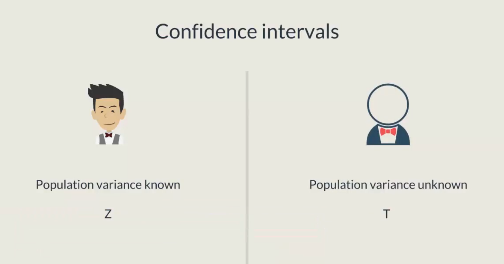
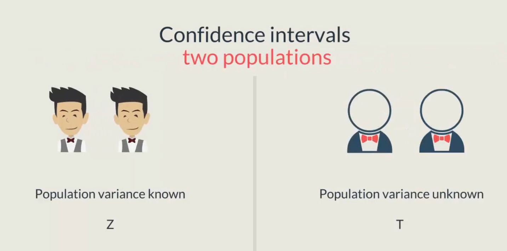
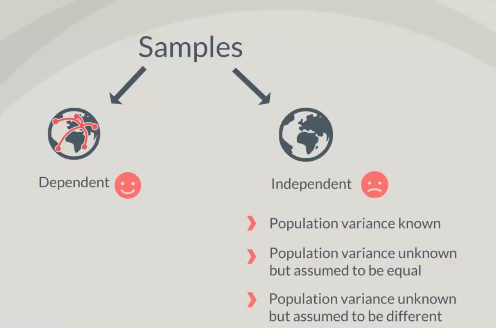
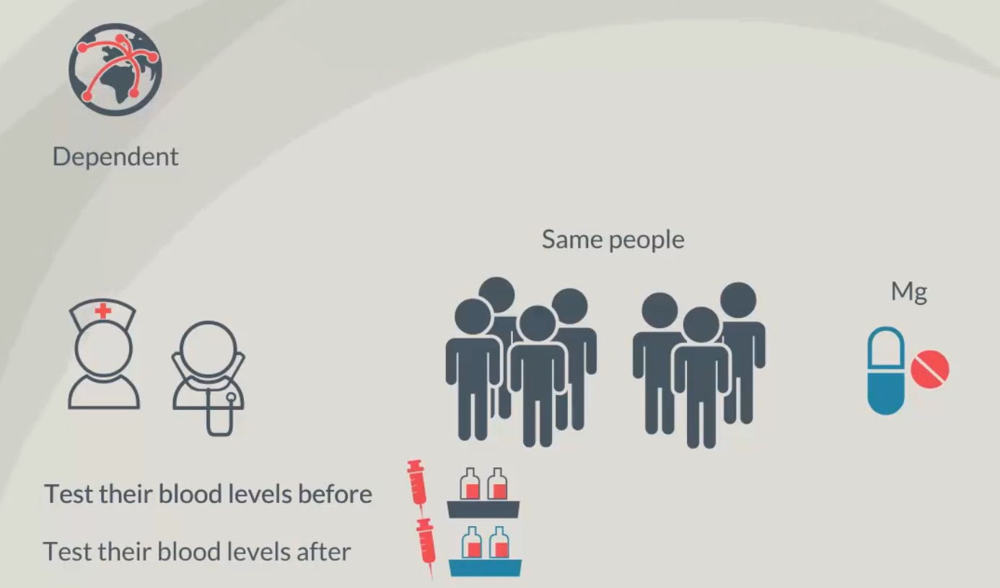
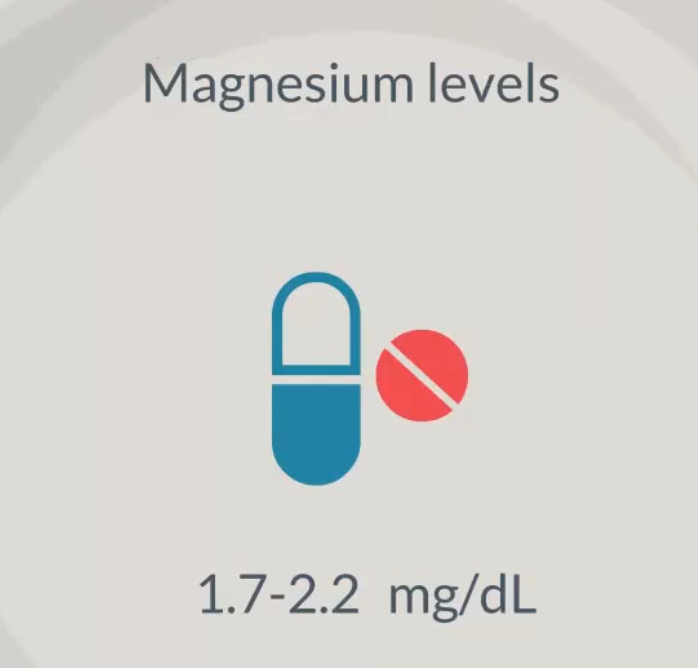
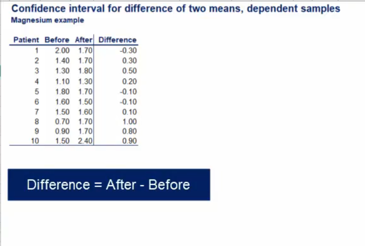
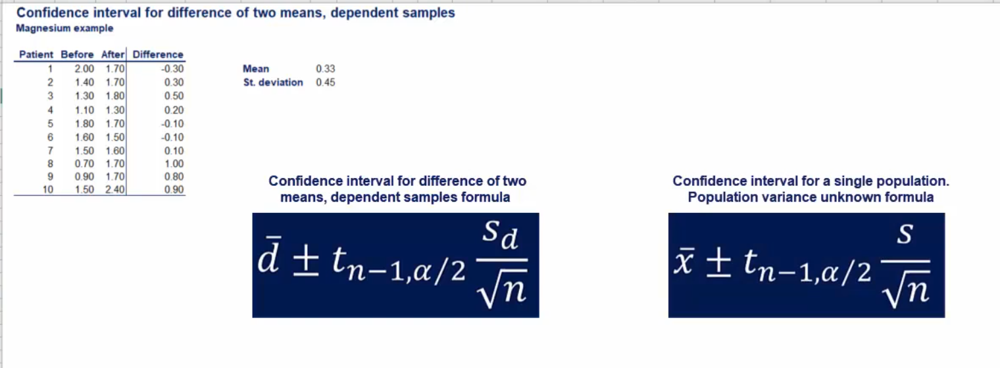
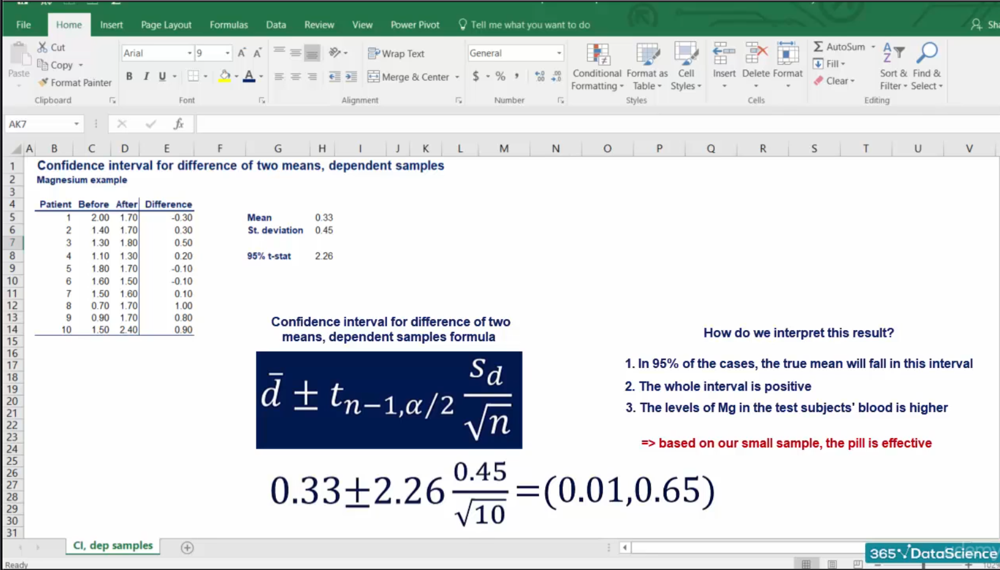
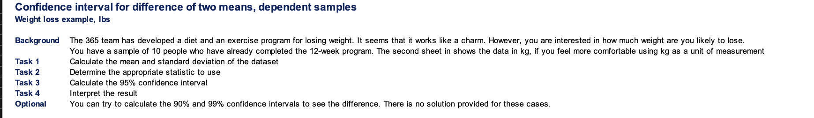
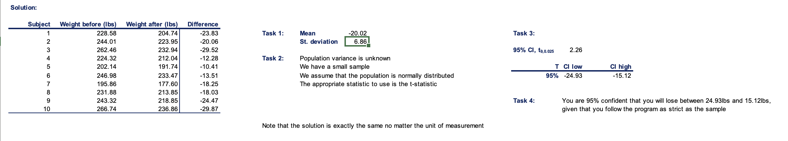

## Topic 

So far we have talked about confidence intervals with population variances that are either known or unknown.



However we were considering only one population in the next couple of lesson. We will explore confidence intervals looking into two populations.



These cases are more important as they have a wide range of real world applications. A few important distinctions need to be made, before we dive into topic in some cases the samples that we have taken from the two populations, will be `dependent` on each other and in others they will be `independent`.


`Dependent samples` are easier, you will experience this firsthand when we have independent samples however we can further distinguish three cases when the population variance is known when the population variance is unknown but assuemed to be equal, and when it is unknown and assumed to be different.




## Dependent Samples

This statistical test is often used when developing medicine. Let's say you have developed a pill that increased the concentration of magnesium in the blood.

It's very promising but there is no data to support your claim.

After testing the drug int he laboaratory, it is time to see it's actual effect on people. What you would typically do is take a sample of 10 people and test their magnesium levels before and after taking the pill.

The two `dependent samples` are the magnesium levels before and the magnesium levels after, it is clear that it is the same people we are testing. Thus the samples are dependent, an important not is that populations are normally distributed.



Actually when dealing with biology. Normality is so often observed that we immediately assume that such variables are normally distributed.


Whenever you take a blood test the magnesium levels are stated in milligrams per deciliter and a healthy person would usually have somewhere between 1.7 and 2.2 miligrams of magnesium per deciliter.



Here is a table that contains the sample of 10 people and their levels of magnesium before and after taking  the pill for some time.

We've also added a cell that calculates the difference in levels before and after taking the pill, instead of dealing with two variable we now have only one.



In this way the data looks as a single population doesn't it.Let's calculate the meand and the standard deviation of the differences

```
Mean :0.33
St.deviation 0.45

Sample size is 10
```

The formula to calculate the population mean is as follows. The population is normally distributed but the sample we have contains only 10 observations. Therefore the distribution will have to work with is student T and the appropriate statistic is t.


You can cleary see that it is the same as the one for a single population with an uknown variance.



Let's chose a level of confidence and plug in the numbers as we have said many times, 95% confidence is one of the most common levels. And so we will use it here as well.

The t statistic with nine degree of freedom for a 95% confidence interval is `2.26`


Now we have everything we need and we can calculate the confidence interval.



### Exercise



### Solution
