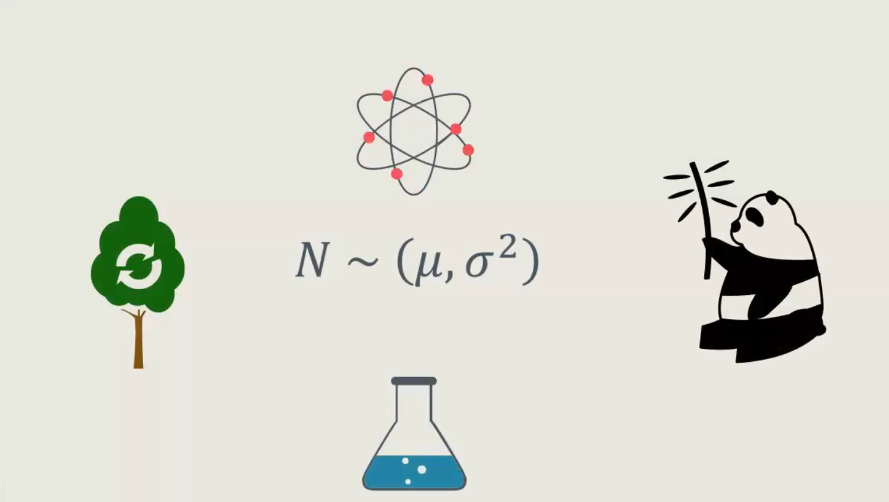
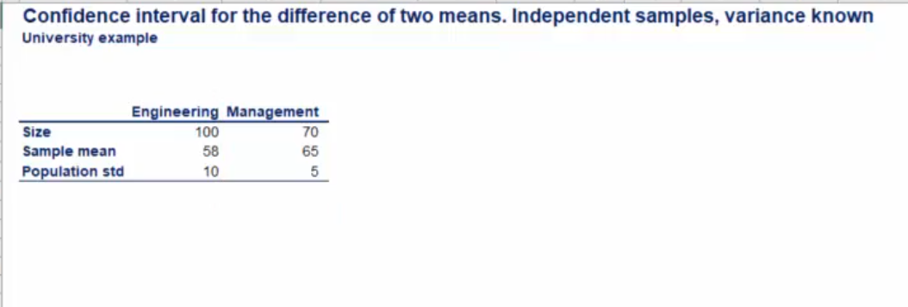
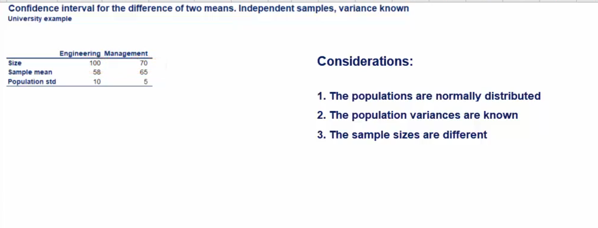
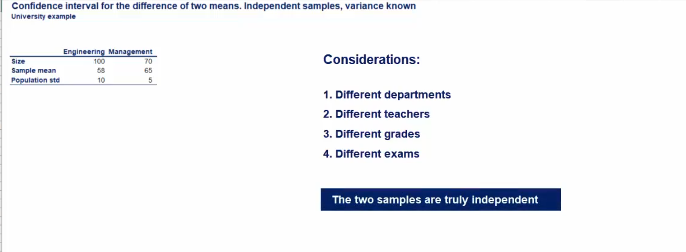
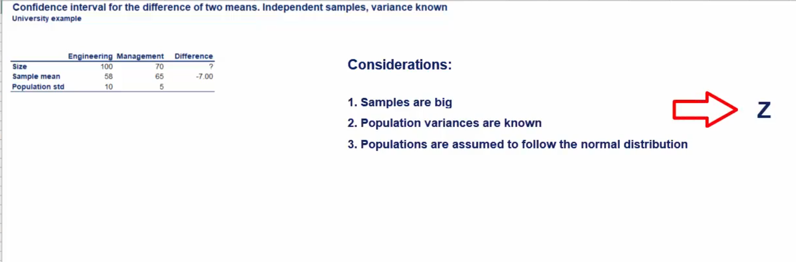
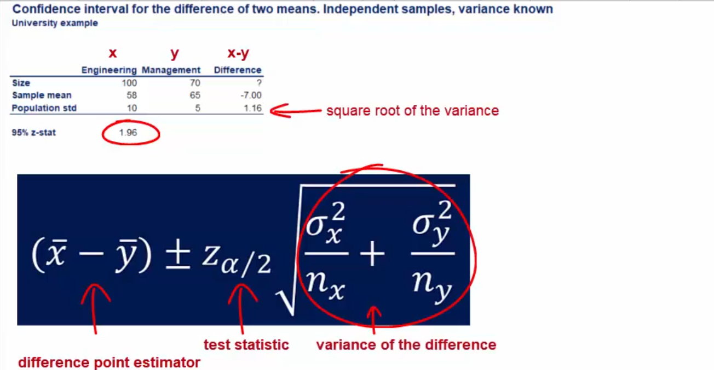
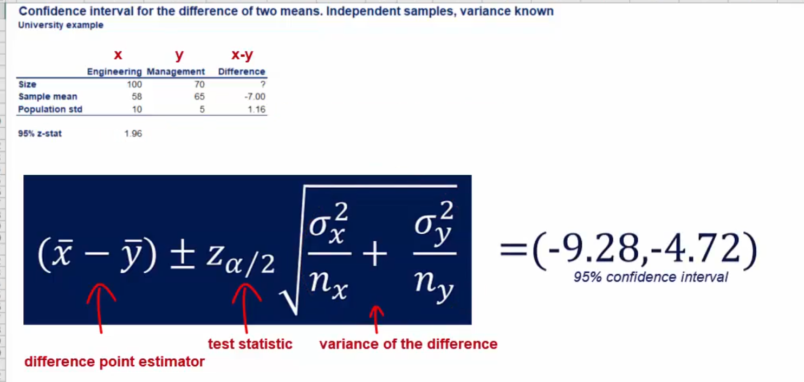
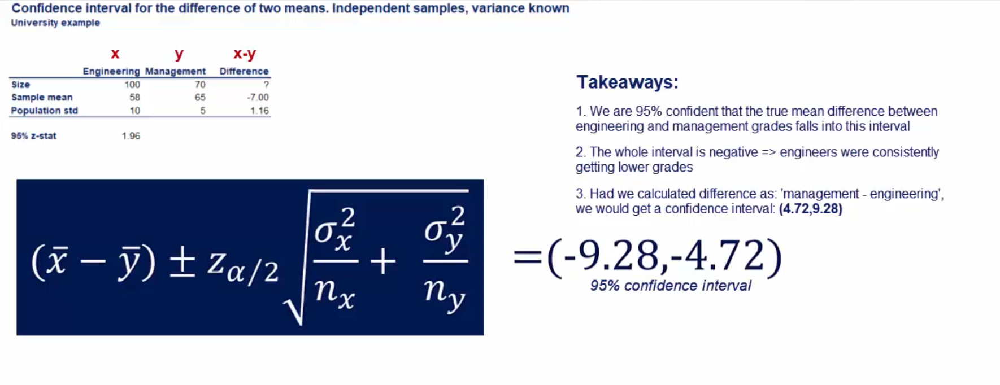
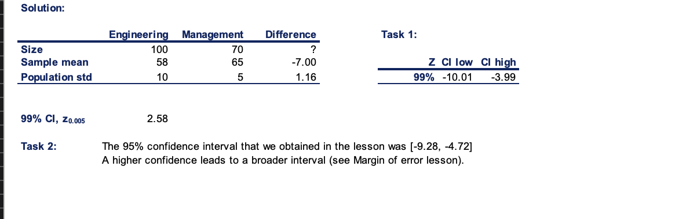

## Topic 

So far we have talked about confidence intervals with population variances that are either known or unknown.


However we were considering only one population in the next couple of lesson. We will explore confidence intervals looking into two populations.


These cases are more important as they have a wide range of real world applications. A few important distinctions need to be made, before we dive into topic in some cases the samples that we have taken from the two populations, will be `dependent` on each other and in others they will be `independent`.


`Dependent samples` are easier, you will experience this firsthand when we have independent samples however we can further distinguish three cases when the population variance is known when the population variance is unknown but assuemed to be equal, and when it is unknown and assumed to be different.


## Dependent Samples

This statistical test is often used when developing medicine. Let's say you have developed a pill that increased the concentration of magnesium in the blood.

It's very promising but there is no data to support your claim.

After testing the drug int he laboaratory, it is time to see it's actual effect on people. What you would typically do is take a sample of 10 people and test their magnesium levels before and after taking the pill.

The two `dependent samples` are the magnesium levels before and the magnesium levels after, it is clear that it is the same people we are testing. Thus the samples are dependent, an important not is that populations are normally distributed.


Actually when dealing with biology. Normality is so often observed that we immediately assume that such variables are normally distributed.



Whenever you take a blood test the magnesium levels are stated in milligrams per deciliter and a healthy person would usually have somewhere between 1.7 and 2.2 miligrams of magnesium per deciliter.


Here is a table that contains the sample of 10 people and their levels of magnesium before and after taking  the pill for some time.

We've also added a cell that calculates the difference in levels before and after taking the pill, instead of dealing with two variable we now have only one.


In this way the data looks as a single population doesn't it.Let's calculate the meand and the standard deviation of the differences

```
Mean :0.33
St.deviation 0.45

Sample size is 10
```

The formula to calculate the population mean is as follows. The population is normally distributed but the sample we have contains only 10 observations. Therefore the distribution will have to work with is student T and the appropriate statistic is t.


You can cleary see that it is the same as the one for a single population with an uknown variance.


Let's chose a level of confidence and plug in the numbers as we have said many times, 95% confidence is one of the most common levels. And so we will use it here as well.

The t statistic with nine degree of freedom for a 95% confidence interval is `2.26`


Now we have everything we need and we can calculate the confidence interval.


### Exercise


### Solution


# Independent Samples

In our last video we learned about confidence intervals for two means based on `dependent samples`. 

In this section we will explore independent samples as we said earlier. There are three sub cased 

```
Confidence Intervals. Independent samples:
1. Known population variances
2. Unknown population variances but assumed to be equal
3. Unknown population variances but assumed to be different.
```

Here we will focus on independent samples with `known population variances`.

We would like to get the test grades of two departments in a UK university. University grades in the UK expressed in percentages.

Our samples are taken from two departments engineering and management. The table you see at the bottom below summarize the data.



But before we get on with calculations. Let's point out three important considerations.



Different sample sizes are a common occurence in the real world.

In the previous lesson when we had dependent samples we were testing the same people over time so it made sense that the sample sizes were equally big.

This time however the observations are completely different. They are students from different departments with different teachers obtaining different grades when taking different exams. 

The grades of a person from engineering doesn't in any way affect the grade of a person studying mangement. The `two samples are truly independent`




> What are we testing?

We want to find a 95% confidence interval for the difference between the grades of the students from the engineering and management.


As with every confidence interval. We must identify the test stastistics



All this information points us to the `Z-statistic` instead of the `T`. The last ingredient is the variance.

We haven't been through enough mathematics in this course to derive the formula so we will simply state it.

The variance of the different between the two means is equal to the variance of the grades received  by the engineering students divided byt he samples sizes of engineering students plus the variance of grades obtained by management students divided by the sample size of management students, the underlying logic is that dispersion is `additive`.

More variable means higher or equal variability.


> What is the confidence Interval formula this time



We plug in the numbers and get a confidence interval between `(-9.28, -4.72), for 95% confidence interval`



> The Interprentation



## Exercise


## Solution


