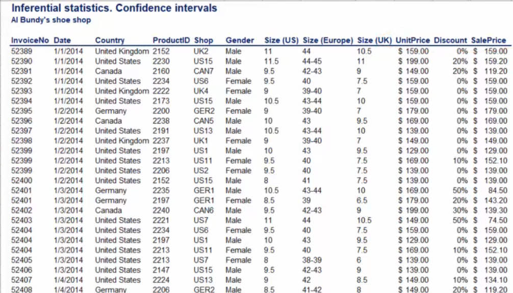
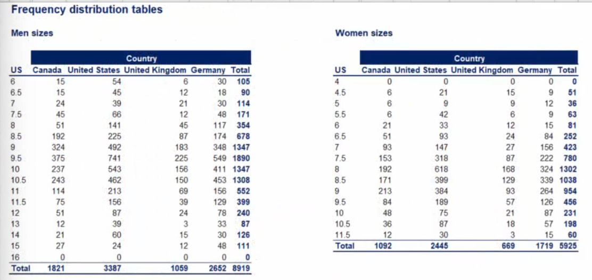
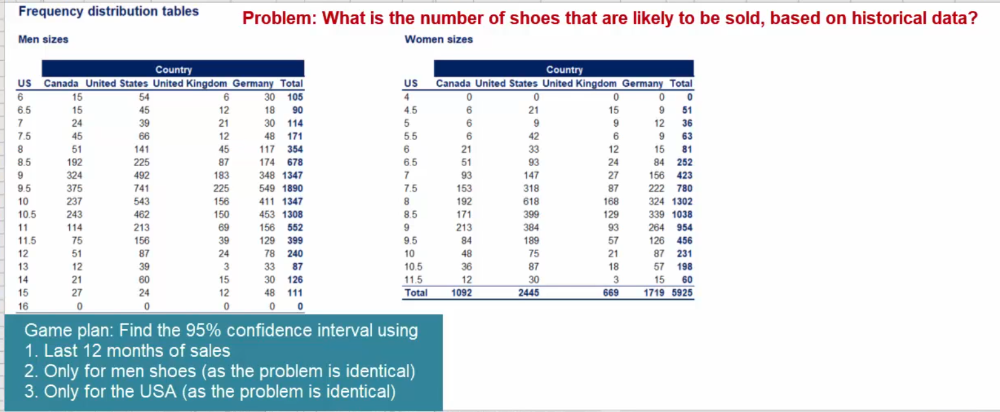
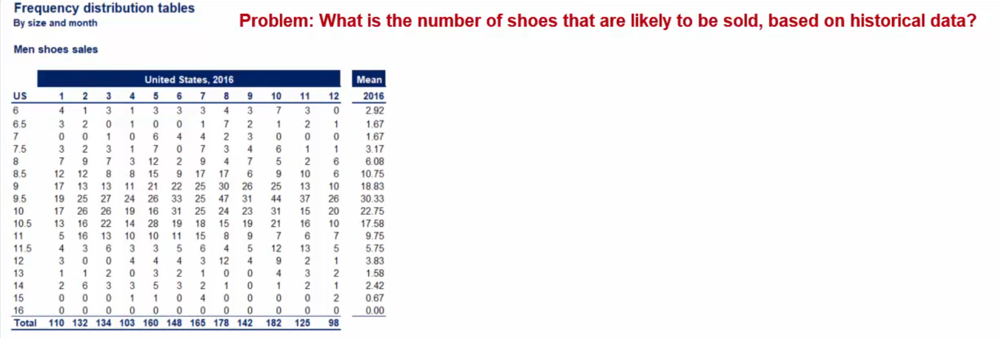

## Topic

Welcome to the second practical example, let me introduce you to the topic.

> Practical Problem

 You are a data analysis for `Al Bundy's` shoe shop. `Al Bundy's` is a U.S based company established 30 years ago. It also operates in Canada the UK, and Germany.

 The firm selles mid to high end shoes, ranging from 120 to 200 dollars while the shoes are of high quality. You have a lot of inventory never sold. The shoes collect dust on store shelves.

 Inventory management is the common problem. Many if not most shops cannot determine the right number of itmems they need to keep in stock. 
 
 The opposite problem arises too. Shop's don't supply an adequate ammount of goods and fail to meet the demand in their market. For instance, you have surely entered a shoe shop but could not buy a specific pair of shoes because they did not have them in stock.

In this example, we will examine the opposite problem. Having too much inventory. This is  a more significant problem for the company as it means the company has inversted in producing or purchasing the product but could not sell it.

One way to solve this problem is by using confidence intervals.

We have seen many examples, but here is a reall life one, we can see a database with the sales information about `Al Bundy Shop` for the years 2014 to 2016.

There's `InvoiceNo`,`Date`,`Country`, `ProductID` and `Shop` which depends on the country. `Gender` indicates if the product's is designe for men or women as shoes differ greatly dpending on gender.

Next we have `shoe size`, apeart from the US size system I have also included the European and the UK ones so it is easier for you to understand the data, if you are used to other sytesm. This filw ill be prodived for you and you can check the shoes size conversion table if you would like to do that.

Finally thee is a `UnitPrice` for that sale and the discound that applies. Let's begin our analysis.

> Let's beign our analysis

First we should determine if that sample or population data. It's obviously a sample not the population of sales given we have just three years of data.

Second we want to get to know the data set better. There are two big subgroups in our data, `men's shoes and women choose, they are different and bundling them when making predictions will yield deceiving results`.

Not only feet differe by gender but also there are different shoe types and models.

Our problem is related to inventory management. Therefore we should divide our inventory and then count the frequencies. The frequencies  will give us a better idea of the data.

A good way to do that is to divide the data by `shoe size`.It is important also to see it in `country wise`. We already know the division by `gender` is also needed so we have three dimensions, `shoe size`,`country` and `gender`.

A possible solutin is to create two tables one from `men's shoes` and one for `women's shoes` and then proeed normally. That's what I will do.

Here are the two tables

In the file provided(Pracctial_example_lesson.xlsx) you can see the formula used to calculate frequencies.

To use confidence intervals, we must have normally distributed data. While this sounds restrictive for all practical applications it isn't.

We can simply apply our good old friend the `central limit theorem` when we are in the presence of a sum or average of many observations, we can assume normality. In our case we are calculating averages sales for a period.

Given that `Al Bundy` shop has been operating for over 30 years, CLT applies and we can safely  continue  with our inference.

We want to estimate the number of shoes that are likely to be sold. A `95%` confidence itnerval will give us such information. We will take the last month of sell and make predication.

Let's do this only for men's shoes as the main problem is identical for both genders. Since people have diffeent shoes sizes we will have to calculate 17 confidence intervals one for each size. Let's get to it.

First we need to calculate the means. Here they are.

We do not know the `population variance` in our sample comprises just 12 observations. We have to use the `t-statistic`. This problem refers to the lesson one with `poulation with population variance unknown`.

We have a sample of 12 observations we are lookin gor the `t-statistic` for a 95% confidence interal with 11 degree of freedom.

## Keywords & Notes

