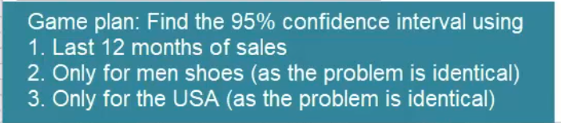
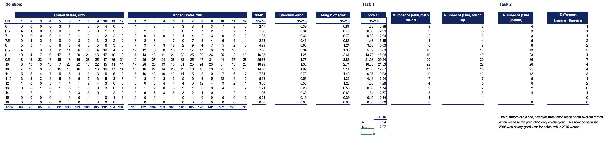

## Topic

Welcome to the second practical example, let me introduce you to the topic.

> Practical Problem

 You are a data analysis for `Al Bundy's` shoe shop. `Al Bundy's` is a U.S based company established 30 years ago. It also operates in Canada the UK, and Germany.

 The firm selles mid to high end shoes, ranging from 120 to 200 dollars while the shoes are of high quality. You have a lot of inventory never sold. The shoes collect dust on store shelves.

 Inventory management is the common problem. Many if not most shops cannot determine the right number of itmems they need to keep in stock. 
 
 The opposite problem arises too. Shop's don't supply an adequate ammount of goods and fail to meet the demand in their market. For instance, you have surely entered a shoe shop but could not buy a specific pair of shoes because they did not have them in stock.

In this example, we will examine the opposite problem. Having too much inventory. This is  a more significant problem for the company as it means the company has inversted in producing or purchasing the product but could not sell it.

One way to solve this problem is by using confidence intervals.

We have seen many examples, but here is a reall life one, we can see a database with the sales information about `Al Bundy Shop` for the years 2014 to 2016.

There's `InvoiceNo`,`Date`,`Country`, `ProductID` and `Shop` which depends on the country. `Gender` indicates if the product's is designe for men or women as shoes differ greatly dpending on gender.

Next we have `shoe size`, apeart from the US size system I have also included the European and the UK ones so it is easier for you to understand the data, if you are used to other sytesm. This filw ill be prodived for you and you can check the shoes size conversion table if you would like to do that.

Finally thee is a `UnitPrice` for that sale and the discound that applies. Let's begin our analysis.

> Let's beign our analysis

First we should determine if that sample or population data. It's obviously a sample not the population of sales given we have just three years of data.

Second we want to get to know the data set better. There are two big subgroups in our data, `men's shoes and women choose, they are different and bundling them when making predictions will yield deceiving results`.

Not only feet differe by gender but also there are different shoe types and models.

Our problem is related to inventory management. Therefore we should divide our inventory and then count the frequencies. The frequencies  will give us a better idea of the data.

A good way to do that is to divide the data by `shoe size`.It is important also to see it in `country wise`. We already know the division by `gender` is also needed so we have three dimensions, `shoe size`,`country` and `gender`.

A possible solutin is to create two tables one from `men's shoes` and one for `women's shoes` and then proeed normally. That's what I will do.

Here are the two tables

In the file provided(Pracctial_example_lesson.xlsx) you can see the formula used to calculate frequencies.

To use confidence intervals, we must have normally distributed data. While this sounds restrictive for all practical applications it isn't.

We can simply apply our good old friend the `central limit theorem` when we are in the presence of a sum or average of many observations, we can assume normality. In our case we are calculating averages sales for a period.

Given that `Al Bundy` shop has been operating for over 30 years, CLT applies and we can safely  continue  with our inference.

We want to estimate the number of shoes that are likely to be sold. A `95%` confidence itnerval will give us such information. We will take the last month of sell and make predication.

Let's do this only for men's shoes as the main problem is identical for both genders. Since people have diffeent shoes sizes we will have to calculate 17 confidence intervals one for each size. Let's get to it.

First we need to calculate the means. Here they are.

We do not know the `population variance` in our sample comprises just 12 observations. We have to use the `t-statistic`. This problem refers to the lesson one with `poulation with population variance unknown`.

We have a sample of 12 observations therefore we are looking for the `t-statistic` for a 95% confidence interal with 11 degree of freedom.

Next we will compute the standard error we will use the good old formula.

While it is unnecessary to go through this step as we have everything we need, I will still show you the margins of error as it may be interesting for some of you to examine.

Finally the confidence intervals are given by the following formula.

And this is how they look after the calculation have been carried out.

The result we obtained could be interpreted as follow in 95% of the cases, the true population mean of the sales for each shoe size will fall into the respective interval. 

As we don't want to be low on stock. A possible solution to the problem is to get as many pairs of shoes as the closet number to the upper limit of the confidence interval.

In this way you will be almost certain you won't run out of stock and shoes won't be waiting forever in your storage unit.

Therefore we should get four pairs of men's shoes size 6, 3 pairs of mean's shoes size 6.5 and so on.

Mostly we should prepare ourselves with size 9.5 and size 16 won't yield in any sales.

I'd like to show you another application of confidence intervals.

Let's say we want to use a confidence interval to see if two shops are selling the same number of shoes. We want to know with 95% confidence by how much one shop outperforms the other in terms of sales.

You can see two tables representing the sales of women's shoes in two `German shops` their codes are `GER1` and `GER2`.

Once again we have data for 2016.

Logically it make sense that in the same year the same people don't go around different shops of the same brand to buy shoes.

Even if this happens it is an exception not the norm. Therefore we can say that two samples are independent.

Once again we don't know the population variance but given this is the same market in the same country, we can assume it is equal.

This implies we're in the case of independent samples with population variance unknown but assumed to be equal, as in the previous case, we need to calculat the means and the sample variance.

Here we must calculate a pooled variance which is an unbiased estimator of the population variance. We're in the case where we have to use the `t-statistics`, with 95% confidence.

What we get from the table is 2.07. The respective margins of error are given by the well-known formula.

Finally the 95% confidence intervals are determined by the means and the margin the margin of error.

We get this 15 intervals

Zero is a part of all of them except for the unellable sie for all confidence intervals start in the negatives and finish in the positives.

This implies we cannot conclude one shop sells more shares than the other for any size.

What it seems like we have no great insight. That's not entirely true.

The confidence intervals we got are not consistently for one shop having higher sales than the other. This is evident from the fact that some are mostly negative while others are mostly positive.

That is to show that for some sizes `GER1` is likely to sell more, while for other vice versa. However our decision was that using this methodology and level of confidence we cannot really identify which shop is selling more, they are identifical. The insight we get is thre two shops are so balanced in sales they may share the same warehouse or exchange pairs of shoes to achieve better results.

They can be bundled together for any analysis action or decision needed. On average they will probably move together if one noticeably outperforms the other.
We many be sure something that wasn't observed before is going on as they are predicted to remain identical.

## Exercise

## Solution

## Keywords & Notes

