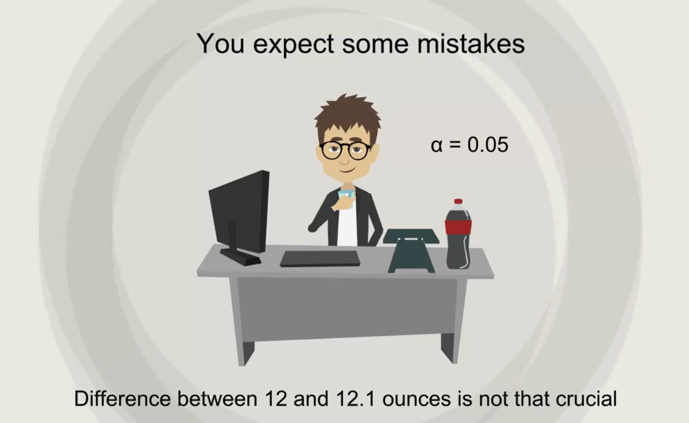

## Topic

This is the main section of this course `Hypothesis testing`. It is based on the knowledge that you acquired previously which is `inferential` and `descriptive` statistics.

`Confidence Intervals` provides us with an `estimation` of where the parameters are located. However when you are making a decision you need a `yes` or `no` answer. The corrent approach in this case is to use a `test`.

In this section we will learn how to perform one of the `fundamental tasks in statistics`

## Keywords & Notes

## Hypothesis Testing

There four steps in data driven decision making. `First` you must formulate  a hypthesis. `Second` once you have formulate a hypothesis, you will have to find the right test for your hypothesis. `Third` execute the test. And `Fourth` you make a decision based on the result.

## What is hypothesis?

A `hypothesis` is an idea that can be tested. This is not the formal definition but it explains the point very well.

So if I tell you that `apples` in `New York` are expensive.  This is an idea or a statment but is not testable untill I have something to compare it with.

For instance if I define `expensive` as any price higher than `$1.75 per pound then it immediately become a `hypothesis`.

> Not a hypthesis 

Something that cannot be tested with a hypothesis. An example may be, `Would the USA do better or worse under a Clinton administration compared to a Trump administration`.

Statistically speaking this is an idea but there is no data to tet it therefore it cannot be a hypothesis of a statistical test.

Actually it is more likely to be a topic of another discipline (`#politicalscience#politics#politicaleconomics`). Conversely in statistics we may compare different `U.S. presidencies` that have alread been completed such as the `Obama administration` and the `Bush administration`, as we have data on both.

> All right let's get out of politics and get into hypothesis.

Here's a simple topic that can be tested, according to `Glassdoor` the popular selling information Website, the mean data scientists salary in the US is $113,000 so we want to test if their estimate is correct.

There are two hypotheses that are made the `null hypothesis` denoted `Ho`h zero and the `Alternative hypothesis` denoted H1 or HA, h one or h a.

The `null hypothesis` is the one to be tested and the `alternative` is everything else.

In our example, the null hypothesis would be the `mean data scientists salary is $113,000` while the alternative `the mean data scientist salary is not $113,000`.

Now you would want to check if `$113,000` is close enough to the true mean predicted by our sample, it case it is, `you would accept the null hypothesis`. Otherwise `you would reject the null hypothesis`

The concept of the null hypothesis is similar to `innocent untill proven guility`. We assume that the `mean salary is $113,000 and we try to prove otherwise`

> All right this was an example of a two sided or a two tailed test.

You can also form `one sided or one tailed test` say your friend Paul told you that he thinks `data scientists make more than $125,000` per year. You doubt him so you design a test to see who is right.

The null hypothesis of this test would be `the mean data scientists salary is more than $125,000 per year`. The alternative will cover everything else. Thus `the mean data scientists salary is less than or equal to  $125,000`.

It is important to not that outcomes of tests refer to the `population parameters` rather than the sample statistic. As such, the result that we get is for `population`, another crucial consideration is that generally the researcher is trying to reject the null hypothesis.

Think about the `null hypothesis` as the `status quo` and the `alternative` as the change or innovation that challenges that `status quo`

In our example Paul was representing the `status quo` which we were challenging.

## Establishing a rejection region and a significance level 

So you know what a hypothesis is and you have an idea of how to form the Null and alternative hypothesis.

In this section we will understand the reason `why hypothesis testing works`. 

Imagine that the actual average grade of all students in a UK university is 55%. The University Dean however believes that on average student obtain 70%.

Of couse you can't just agreee with his opinion. So you start testing, `the hypothesis is the population mean grade is 70%`. `The alternative hypothesis is the population mean grade is different than 70%`

> So why does hypothesis testing work

We assume that the population of grades is normally distributed. The true population mean is 55%. The idea is to test if `70% is the true mean` or in our example if `70% is close enough to 55% `, this part is called the rejection region.

If the `null hypothesis` vallue is inside the rejection region, you reject the `null hypothesis`.

Now image that the old Dean who got fired recently told you that the meand grade is `56%`. In taht case if you wan tto test his opinion the `null hypothesis` would be the population means is equal to 56%. This value is much closer to 55% and far away from the rejection region. You will most likely accept the null hypothesis. 

In statistical jargon, you cannot say that 56% is no the population mean, this will all become clear soon enough.

There is one more important part of testing the `significance level`. The `significance level` is denoted by Alpha. it is the probability of rejecting the `null hypothesis` if it is true. The rejection region depends on the Alpha as pointed in the graph.

Typical values for Alpha are `0.01`, `0.05` or `0.1`. it is a value that you select based ont eh certainty you need. In most cases the choice of Alpha is determined by the context you are operating in.

For example if you need to test if a machine is working properly you would expect it to make little or no mistakes as you want to be very precise. You should pick a low significance level such as `0.01`. The famous Cocal-cola glass bottle is 12 ounces. If the machine pours 12.1 ounces some of the liquid will be spilled and the label will be damanage as well. So in certain situation we need to be as accurate as possible.

However if we were analyzing human or company behaviour we would expect a more random behavior and hence a higher degree of error.For exampl if we want to predict how much Coca-cola consumers drink on average, the difference between 12 ounces and 12.1 ounces will not be that crucial. So we can choose a higher significance level.

Our graph so far we're showing rejection regards for two sided tests such as the one where we tested whether our population mean is equal to `70%` in these cases, the significance level `alpha` is divided between the two sides of the normal distribution. On the left we have a significance of `alpha/2` and on the right, we have another `alpha/2`

This is due to the fact that the true mean could be either 55% or 85% in both cases. We are equally likely to reject the null hypothesis but on a different side of the distribution. 

What about `one tailed` tests which look in the following way. Is the mean lower than 70%. And in each oen is the mean hgier or equal to `70%`. In this case the rejection region will only be ont he right side with a significant level of alpha.

And to complete the picture, here's a plot of the third case defiend by an age zero of the mean higher than 70%

## TYPE I ERROR VS TYPE II ERROR

In this section we will learn about the error that can be made in hypothesis testing.

In general we can have to types of error type 1 error and type 2 error.

First we will define the problems and then we will see some interesting examples.

`Type I eror` is when you reject a true null hypothesis and si the more serious error. It is also called `false postive`.The probability of making this eror is `alpha`, the level of significance, since you the researcher choose the alpha, the responsibility for making this error lies solely on you.

`Type II error` is when you accept a false null hypothesis. The probability of making this error is doneted by `beta` depends mainly on sample size and population variance. So if your topic is difficult to test due to hard sampling or as high variability it is more likely  to make this type of error. As you can imagine if the data set is hard to test it is not your fault. So `Type II error` is considered a smaller problem.

We should also mention that the probability of rejecting a false null hypothesisi is equal to `1-beta`. This is the researcher go to reject a false null hypotheis. Therefore `1-beta` is called `the power of the test`.

Generally researchers increate the power of a test by increasing the sample size.

This is a common table statiticians used to summarize the type of errors.

Now let's see an example that If heared from my professor back when I was studying stastics in university

You're in love with this girl from the other class but are unsure if she like you. There are two errors you can make. First if she like you back and you don't invite her out you are making the `type I error`.

The `null hypothesis in this situation is he like you back`. It turns out that she reeally did like you back. Unfortunately you did not invite her out because after testing the situation you wrongly thouth the `null hypothesis was false`

In other words you reject a true null hypothesis and lost her chance. It is very serious problem because you could have been made for other but you didn't even try.

Now imagine another situation she doesn't like you back but you go and invite her out. `The null hypothesis` is still she likes you back but this time is false. In reality `she doesn't really like you back`. That is however after testing you accept the `null hypotheses` and wrongly go and invite her out. She tells you that she has a boyfriend that is much older smatter and better at statistics than you and turns her back. You made a `type 2 error accpeted a false null hypothesis`.

However is not big deal as you go back to your normal life without her and soon forget about this awkward situation. Hypothisis testsing is usually like that. You don't really want to make any of the two error it happens sometimes. You should be aware that statistics is very useful but not perfect.

## Test for mean Dependent samples

We are not done with Hypothesis Testing just yet remember how we started with confidence intervals for a single population meand and then switched to examples considering multiple populations.

While we are in the same situation here, single population are just the begining time to do multiple means

> Multiple populations

We will start with `Dependent samples`. The most initive examples of dependent sample are the one you have been through like `weight loss` and `blood tests`.

The sample is drawn from Weight-Loss data or concentration of nutrient data. But the subject of interest is the same person before and after.

Do you recall our exampe with the magnesium levels in one's blood. There was this drug company developing a new pill that supposably increase levels of magnesioum of recipents. There was 10 people involved in teh study that were taking the drug for some time and we calculated confidence intervals that helped us study the effects of that drug.

They indicated the range of plausible values for the population mean. This time we want to come to a single definite conclusion about the effectiveness of the drug.

Let's state the null hypothesis, The population mean before is greater or equal than the population mean after, the alternative is that the population mean before is lower than the one after. Once again we want to know if the magnesium levels are higher.

We construct a null and alternative hypotheis in such a way so that we are aiming to reject the null hypothesis.

Ok let's reroder a bit. Age 0 is `myu` before which is equal or higher than `myu` after this is equivalent to `myu` before minus `myu`ater is equal to zero or positive.

We can subsitute this with capital `D0, it stands for the hypothesized populaion mean difference. So we restate our hypotheses using d for simplicity.

Now we have our test designed. Let's crunch some numbers. Here's the data set. We have 10 observation people have registered befor and after. Naturally the difference is equal to before minus after we can calculate the sample mean of the difference we get minus `0.33`. The sample standar deviation is `0.45` and standard error is `0.14`. The appropriate statistic to use here is the `t statitics, we have a small sample. WE assume normal distribution of the population and we don't know the variable.

So the `t-score` is eual to the following expression. Now we can simply carry up the calculation and find that it's value is negative 2.29,

Since we don't want to choose a level of significance. Well let solve the proble with the p-value in order to find the value of this one sided test. In order to find the value of this one side test. We may go to the table and see it is somewhere between 0.01 and 0.025. As I told you ealer usig software is much easier. So after using an online p-value calculator I can tell you that it is exactly 0.024

What was the decison rule again. If the pvalue is lower than the significance lewl we can intererested in, we reject the null hypothesis. Ok so if the level of significance is 0.05 and the pvalue is lower we will be able to reject the hypothesis at 5%, if the level of significance is 0.01 however the pvalue is hgier, so we cannot reject the null hypothesis at a 1% level of significance.

The lowerst value for which we can reject it is 0.24 which is exactly the pvalue.

> What does this tell us?

Well it is up to the researcher to choose the level of signficance in the case of the magnesium pill. We expect that the researchr will be very cautious as he would want to know if this is an effective pill they will be able to actually help people. If we cannot say taht the pill works at a 1% significance level perhaps it is better to take it back to the laboratory and alternative would be test again and increase the sample size for better results. A sample of 100 people would improve the level of precision significantly.

