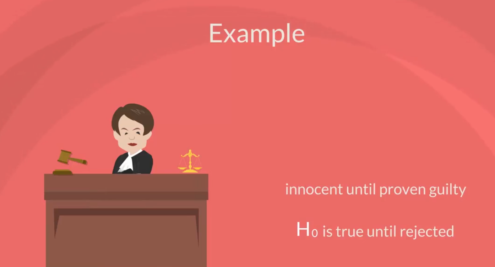
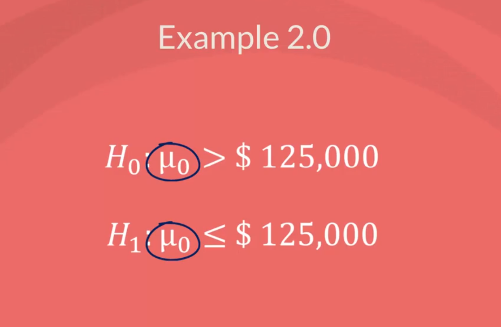

## Topic

This is the main section of this course `Hypothesis testing`. It is based on the knowledge that you acquired previously which is `inferential` and `descriptive` statistics.

`Confidence Intervals` provides us with an `estimation` of where the parameters are located. However when you are making a decision you need a `yes` or `no` answer. The corrent approach in this case is to use a `test`.

In this section we will learn how to perform one of the `fundamental tasks in statistics`

## Keywords & Notes

## Hypothesis Testing

There four steps in data driven decision making. `First` you must formulate  a hypthesis. `Second` once you have formulate a hypothesis, you will have to find the right test for your hypothesis. `Third` execute the test. And `Fourth` you make a decision based on the result.

## What is hypothesis?

A `hypothesis` is an idea that can be tested. This is not the formal definition but it explains the point very well.

So if I tell you that `apples` in `New York` are expensive.  This is an idea or a statment but is not testable untill I have something to compare it with.

For instance if I define `expensive` as any price higher than `$1.75 per pound then it immediately become a `hypothesis`.

> Not a hypthesis 

Something that cannot be tested with a hypothesis. An example may be, `Would the USA do better or worse under a Clinton administration compared to a Trump administration`.

Statistically speaking this is an idea but there is no data to tet it therefore it cannot be a hypothesis of a statistical test.

Actually it is more likely to be a topic of another discipline (`#politicalscience#politics#politicaleconomics`). Conversely in statistics we may compare different `U.S. presidencies` that have alread been completed such as the `Obama administration` and the `Bush administration`, as we have data on both.

> All right let's get out of politics and get into hypothesis.

Here's a simple topic that can be tested, according to `Glassdoor` the popular selling information Website, the mean data scientists salary in the US is $113,000 so we want to test if their estimate is correct.

There are two hypotheses that are made the `null hypothesis` denoted `Ho`h zero and the `Alternative hypothesis` denoted H1 or HA, h one or h a.

The `null hypothesis` is the one to be tested and the `alternative` is everything else.

In our example, the null hypothesis would be the `mean data scientists salary is $113,000` while the alternative `the mean data scientist salary is not $113,000`.

Now you would want to check if `$113,000` is close enough to the true mean predicted by our sample, it case it is, `you would accept the null hypothesis`. Otherwise `you would reject the null hypothesis`

The concept of the null hypothesis is similar to `innocent untill proven guility`. We assume that the `mean salary is $113,000 and we try to prove otherwise`

> All right this was an example of a two sided or a two tailed test.

You can also form `one sided or one tailed test` say your friend Paul told you that he thinks `data scientists make more than $125,000` per year. You doubt him so you design a test to see who is right.

The null hypothesis of this test would be `the mean data scientists salary is more than $125,000 per year`. The alternative will cover everything else. Thus `the mean data scientists salary is less than or equal to  $125,000`.

It is important to not that outcomes of tests refer to the `population parameters` rather than the sample statistic. As such, the result that we get is for `population`, another crucial consideration is that generally the researcher is trying to reject the null hypothesis.

Think about the `null hypothesis` as the `status quo` and the `alternative` as the change or innovation that challenges that `status quo`

In our example Paul was representing the `status quo` which we were challenging.

