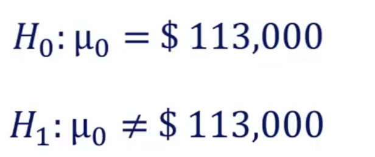
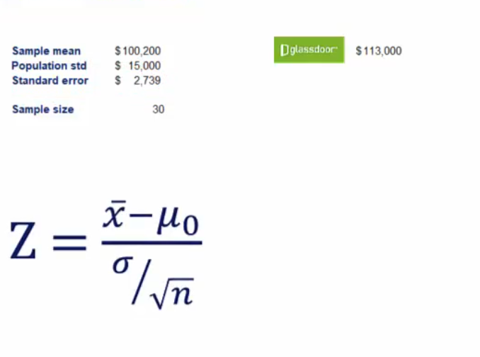
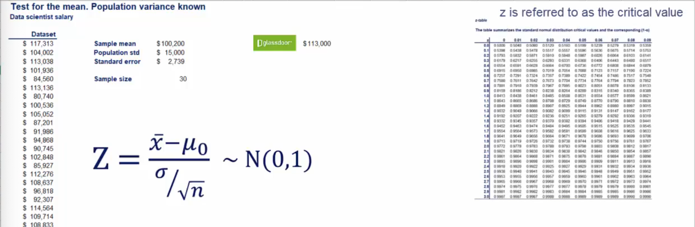
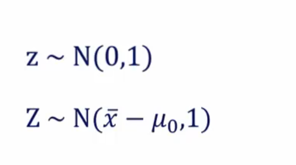
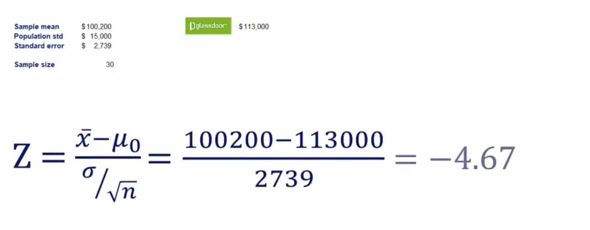

## Topic
Now that we've covered the necessary theory it is time for some testing. We are going to explore two types of tests drawn from a single population and drawn from multiple populations.

This is very similar to confidence intervals for a single populationa and confidence intervals for two population that we convered previously

In the next few sessions, we will run tests for a single mean with both known variance and unknown variance.

Let's start with the test in chich the `variance is known`.

## Keywords & Notes

## Single population

For this tests, we will use our good old data scientist salary example. Here's the data set one more time, by now, I hope you are able to calcuate the sample mean. It is `$100,200`. The population variance is known and it's standard deviation is equal to `$15,000`. Moreover the sample size is 30.

However you swa that aaccording to `Glassdoor` the popular salary information website, the mean data scientists salary is `$113,000`. The sample that is availabel on `glassdoor` is based on `self-reported` numbers and you would like to see if it's value is correct.

We needed a two sided test as we were interested in known both if the salary is significantly less than that or significantly more than that.

The null hypothesis is the `population mean salary is $113,000`. We denote as, see below.

The alternative hypothesis is that the population mean is different than `$113,000`

`Testing is done by standardizing the variable at  hand and comparing it to the z which follows a standard normal distribution`

We standardize a variable by substracting the mean and dividing by the standard deviation.

`A variable is standardized by substracting the mean and diving by the standard deviation`.

Since it is a sample we use the `standard error`. Thus the formula for standardization becomes captial Z is equal to the sample mean minus the value of interest from the null hypothesis divided by standard error.

In this way we obtain a distribution with a mean of zero. Any standard deviation of one the upper case z should not be mistaken with the lowercase Z.

`The uppercase Z is the standardized variable associated witht he test and will be called the Z score`. The lower case z is the one from the table we talked about before and henceforth will be reffered to as the critical value.

> How does the test work

Think about this, the lowercase z is normally distributed with a mean of 0 and standard deviaiton of 1. The upper case Z is normally distributed with a mean of X bar mins mue and standard deviation.

`Standardization lets us compare the means`, the closer the difference of x bar minus mue 0 to zero the closer the z score itself to zero, this implies a higher chance to accept the `null hypothesis`.

> Let's go back to the example.

So what is the value of our standardized variable replug in the numbers that we have from the begining of the lesson. What we get is a z score of minus 4.67

> Now we will compare the ~-score to the cirital value

Now we will compare the absolute value of minus 4.67 with a Z of alpha divided by 2 where 
