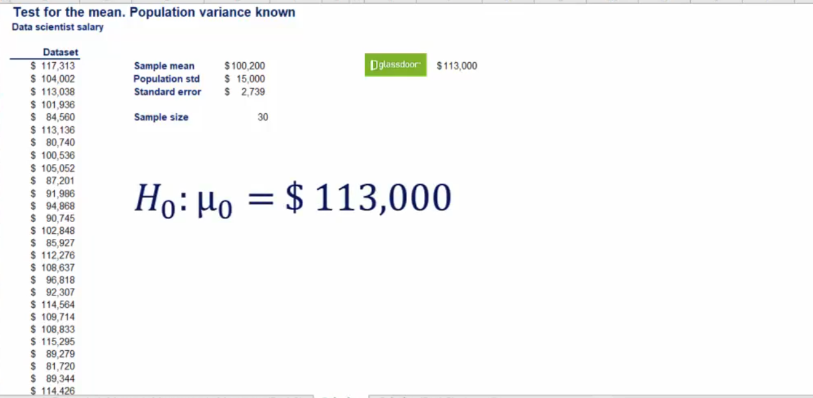

## Topic
Now that we've covered the necessary theory it is time for some testing. We are going to explore two types of tests drawn from a single population and drawn from multiple populations.

This is very similar to confidence intervals for a single populationa and confidence intervals for two population that we convered previously

In the next few sessions, we will run tests for a single mean with both known variance and unknown variance.

Let's start with the test in chich the `variance is known`.

## Keywords & Notes

## Single population

For this tests, we will use our good old data scientist salary example. Here's the data set one more time, by now, I hope you are able to calcuate the sample mean. It is `$100,200`. The population variance is known and it's standard deviation is equal to `$15,000`. Moreover the sample size is 30.

However you swa that aaccording to `Glassdoor` the popular salary information website, the mean data scientists salary is `$113,000`. The sample that is availabel on `glassdoor` is based on `self-reported` numbers and you would like to see if it's value is correct.

We needed a two sided test as we were interested in known both if the salary is significantly less than that or significantly more than that.

The null hypothesis is the `population mean salary is $113,000`. We denote as, see below.

The alternative hypothesis is that the population mean is different than `$113,000`

`Testing is done by standardizing the variable at  hand and comparing it to the z which follows a standard normal distribution`

We standardize a variable by substracting the mean and dividing by the standard deviation.

`A variable is standardized by substracting the mean and diving by the standard deviation`.

Since it is a sample we use the `standard error`. Thus the formula for standardization becomes captial Z is equal to the sample mean minus the value of interest from the null hypothesis divided by standard error.

In this way we obtain a distribution with a mean of zero. Any standard deviation of one the upper case z should not be mistaken with the lowercase Z.

`The uppercase Z is the standardized variable associated witht he test and will be called the Z score`. The lower case z is the one from the table we talked about before and henceforth will be reffered to as the critical value.

> How does the test work

Think about this, the lowercase z is normally distributed with a mean of 0 and standard deviaiton of 1. The upper case Z is normally distributed with a mean of X bar mins mue and standard deviation.

`Standardization lets us compare the means`, the closer the difference of x bar minus mue 0 to zero the closer the z score itself to zero, this implies a higher chance to accept the `null hypothesis`.

> Let's go back to the example.

So what is the value of our standardized variable replug in the numbers that we have from the begining of the lesson. What we get is a z score of minus 4.67

> Now we will compare the z score to the cirital value

Now we will compare the absolute value of minus 4.67 with a Z of alpha divided by 2 where alpha is the significance level.

Note that we use the absolute value as it is much easier to always compare positive capital Z with positive lower z's. Mowerver some Z tables don't includes negative values.

You should be aware that the two statements minus 4.67 is lower than the negative critical value, is the same as 4.67 hihger than the positive critical value.

Thus our decision rule becomes absolute value of the `z score` should be higher than the absolute value of the crital value.

 Using `5%` significance, our alpha is 0.05. Since it is a two sided test we check the bale for Z of 0.05 the corresponding value is 1.96.

 

 The last thing we need to compare our standardized variable to is the crital value.

 If the z score is higher than 1.96 we would reject the null hypothesis, if it is lower we will accept it.

 `4.67` is higher than `1.96`. Therefore we reject the null hypothesis.

 

 The answer is that at 5% significance level we have rejected the null hypothesis or at `5% significance level we have rejected the null hypothesis`.

 Or "There is no statistical evidence that the mean salary is $113,000.

 

 There are many other ways to express this and you will probably hear more about this later in the course.
 
 What if we had a difference level using 1% significance, we have an alpha of 0.01. So Z of alpha divided by 2 is 2.58. Once again our z score is 4.67 is higher than 2.58 so we would reject the null hypothesis, even at the 1% significance

 

 But how much further can we go before we cannot reject the null hypotheis anymore, 0.5% of 0.1%?

 There is a a special technique that allows us to see what the signifcance of all is after which we will be unable to reject null hypothesis. We will see it in our next section.

 ## Exercise

## Solution

## What is the p-value and why is sit one of the most useful tool for statisticians?

Now we know how to test hypothesis and how to reject them. Actually we reject the hypothesis at various levels of significance but we couldn't find a level of significance for which we could no longer do it.

This is the right moment to introduce a measure called the `P-value`. This is the most common way to test hypothesis instead of testing at pre-assigned levels of significance. We can find the smallest level of significance at which we can still reject the null hypothesis given the observed sample statistics.

So how we do that. Recall the test with the data scientists salary. We had a standard error of `2739`, known population standard deviation of 15,000, normally distribute population and a sample size of 30, the corresponding z score was minus 4.67.

We reject the null at 0.05 and 0.01. But we wanted to know how much lower we could go. We can check the Z table for plus 4.67 which gives us the same result as minus 4.67. 

In most Z table, you would not find this value as it is so large. Thus we round up to the close's value available and get 0.0001.

> But how do we actually test the hypothesis?

Well after choosing a significance level of alpha you compare the P-value to it. `You should reject the null hypothesis if the pvalue is lower than the significance level.`

Therefore we can safelty say that such a result is extremely significant by any measure of significance.

Let's see another example, if our z score was 2.12 we should reject the null hypothesis at 5% but not reject it at 1% significance. 

Now it becomes more interesting at this point, we can actually look at the table and then find the pvalue. We look for the value that corresponds with 2.12 and find that it is 0.983 the pvalue for a one sided test is (1- number we see on the table). So the corresponding pvalue is equal to `0.017`. The pvalue for a two sided test is (1 - the number we see in the bale) multiplied by 2. Therefore the pvalue would be 0.034, this is also the answer to our question.

> Wehere and how are pvalues used

Most statistical software packages run tests and then provide us with a series of results, one of them is p-value. It is then up to the researcher to decide whether the variable is statistically significance or not. Generally software is designed to calcuate the p-value to the third digit after separator.

The point is when you start conducting your own research you would love to be able to see the three zerors after the dot. The closer to 0 your pvalue is the more significant is the result you've obtained.

The final consideration is taht the pvalue is an extremely powerful measure as it works for all distributions, no matter if we are dealing with the normal Student's t, binomial or uniform distribution.

Whatever the test the `p-value` rationale hold if the `p-value` is lower than the level of significance you reject the null hypothesis. Having said that you would normally use the p-value in the presence of a digital medium.

Throughout this couse I recommend that you use online `p-value` calculators to support your studies and double check your answers.

## Test for the mean_ Population variance unknown

Now that we know what the p-value is and how to use it we will go back to hypothesis testing.

We saw only one of the two possilbe cases. We haven't covered the more commonly observed case when the `population variance is unknown`.

Imagine you are the marketing analyst of a company and you've been asked to estimate if the e-mail open reate of one of the firm's competitiors is above your company's.

Your company has an open rate of 40%, an email open rate is a measure of how many people on the e-mail list actually opne the e-mails they have received.

At first you struggled to figure out how to get such specific information about a competitor company but then you see that an employee of that competitor company posted a selfie on Facebook, saying oh well the email management softwae we are using drives me nuts in the background, you can see her screen and it shows clearly the summaries of the last 10 email compaigns that were sent and their corresponding open rates.

With statistical skills that is only what you needs. That's all you neea a little help from Facebook.

Let's formulate the hypothesis. `Null hypotehsis` mean open rate is lower or equal to 40%. Alternative hypothesis mean open rate is higher than 40 percent. 

Now that in hypothesis testing we are aiming to reject the null hypothesis when we want to test if the open rate is hger than 40 perecent. The null hypothesis actually state the opposite statement. Also pay attention that this time we're dealing with one sided test.

Your boss told you that 0.05 is an adequate significance level for this test. So that is what you will use.

Here's the data set you calculate the sample mean and get 37.7%. The sample standard deviation is 13.74%. Thus the standard error is 1.37%.

You assume that the populatio of open rates of sent emails is normally distributed like confidence intervals with variance unknown and small sample, the correct statistic to use is the t-statistics.

Remeber you don't know the variance and the sample is not big enough.This means that the variable follows the Studen'ts t distribution and you must employ the t statistic. Let's calculate it then we calculate the T score the same way as the Z score, the t score is equal to the sample means minus the hypothesized mean value divided by the standard error. The result that we get is minus 1.67 as we said earlier is easier to work with positive numbers so we should compare the absolute value of minus 1.67 with the appropriate t with and minus 1 degree of freeddom at 0.05 one sided signficance. We quickly naviage through the tabl eand get 1.833 at the 5 percent significance critical value.

Ok 1.67 is lower than 1.83. Remember the desicion rule.

`If the absolute value of T score is lower than the statistic from the table we cannot reject the null hypotheis`. Therefore we must accept it.

What you do next is you go and tell your boss that at this level of significance statistically we cannot say that the email open rate of our compatitiors is hgier than 40%.

What about the second measurement we saw. What was that. Ah yes, the p-value of the statistic is 0.065 as the p-value is greater than the significance level of 0.05. We come to the same conclusion, we cannot reject the null hypothesis.

Le't do a quick check, if the signficacne leve was 0.01, the pvalue would still be higher and we wouldn't reject the null hypothesis. This is an important obeservation that we haven't noted before.

If we cannot reject a test at 0.05 significance we cannot reject it at samller levels either.

## Exercise

## Solution

